# Sistemi e Reti — Capitolo 1
# Il sistema di elaborazione

> **Obiettivo del capitolo:** comprendere come è organizzato un sistema di elaborazione, come CPU, memorie, bus e periferiche collaborano e come un programma viene eseguito dal processore.

---

## Indice

1. [Il sistema di elaborazione](#1-il-sistema-di-elaborazione)
2. [Il modello funzionale](#2-il-modello-funzionale)
3. [La CPU](#3-la-cpu)
4. [I bus](#4-i-bus)
5. [La memoria cache](#5-la-memoria-cache)
6. [La memoria centrale](#6-la-memoria-centrale)
7. [Le memorie secondarie](#7-le-memorie-secondarie)
8. [Le periferiche](#8-le-periferiche)
9. [Gli standard di interfacciamento alle periferiche](#9-gli-standard-di-interfacciamento-alle-periferiche)
10. [Il ciclo di esecuzione della CPU](#10-il-ciclo-di-esecuzione-della-cpu)
11. [Il pipelining](#11-il-pipelining)
12. [Architetture CISC e RISC](#12-architetture-cisc-e-risc)
13. [Mappa concettuale del capitolo](#13-mappa-concettuale-del-capitolo)
14. [Tabella riepilogativa](#14-tabella-riepilogativa)
15. [Domande di autoverifica](#15-domande-di-autoverifica)
16. [Glossario](#16-glossario)

---

# 1. Il sistema di elaborazione

Un **sistema di elaborazione** è un insieme organizzato di componenti hardware e software che permette di:

- acquisire dati;
- memorizzare dati e istruzioni;
- elaborare i dati;
- produrre risultati;
- comunicare con dispositivi esterni.

Un computer può quindi essere visto come un sistema che realizza il ciclo:

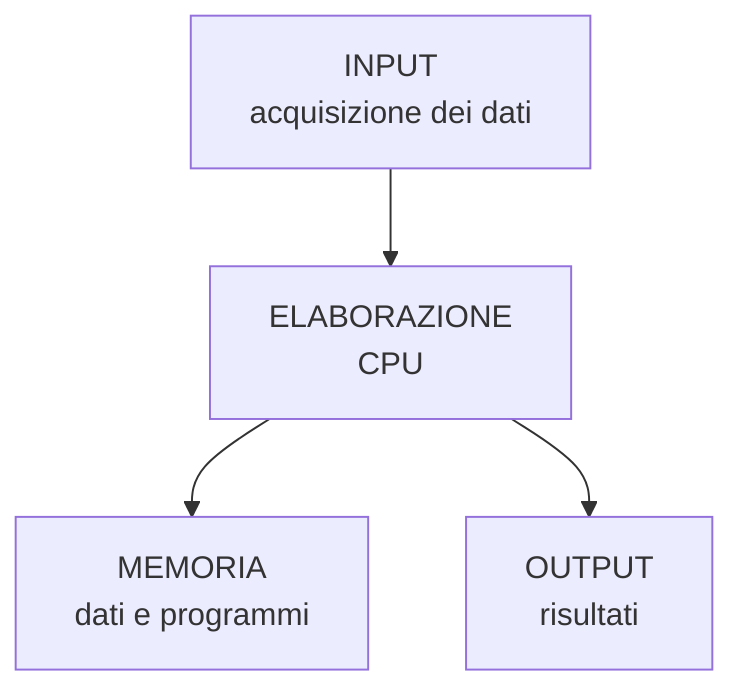

## Componenti fondamentali

| Componente | Funzione principale |
|---|---|
| **CPU** | Esegue le istruzioni ed elabora i dati |
| **Memoria centrale** | Contiene temporaneamente programmi e dati in uso |
| **Memorie secondarie** | Conservano dati e programmi in modo persistente |
| **Bus** | Trasportano dati, indirizzi e segnali di controllo |
| **Periferiche di input** | Permettono di introdurre dati nel sistema |
| **Periferiche di output** | Presentano all'esterno i risultati |
| **Periferiche I/O** | Consentono sia input sia output |

---

# 2. Il modello funzionale
## Approfondimento: dal modello teorico all'architettura reale

Il modello di Von Neumann è un **modello funzionale**, cioè descrive quali funzioni devono essere svolte dal sistema e come possono essere organizzate. Non deve essere interpretato come una fotografia precisa della scheda madre di un computer moderno.

Nei sistemi contemporanei la situazione è più articolata. La CPU può contenere controller della memoria, cache di più livelli, unità di esecuzione parallele e sistemi di interconnessione molto più sofisticati del semplice bus condiviso rappresentato nei diagrammi didattici. Anche le periferiche possono avere processori propri e trasferire dati senza coinvolgere continuamente la CPU.

Il modello rimane però fondamentale perché permette di rispondere a una domanda essenziale: **chi produce, conserva, trasferisce ed elabora l'informazione?**

### Dati e istruzioni

Una distinzione utile è quella tra **dato** e **istruzione**:

- un dato è un'informazione sulla quale il programma deve operare;
- un'istruzione specifica quale operazione deve essere compiuta;
- entrambe devono essere rappresentate in una forma codificata comprensibile dall'hardware.

Per esempio, un programma potrebbe richiedere:

```text
somma il valore contenuto in R1 con quello contenuto in R2
```

A livello macchina questa richiesta viene rappresentata mediante una specifica istruzione dell'ISA del processore.

### Il collo di bottiglia di Von Neumann

Il modello evidenzia anche un problema strutturale: istruzioni e dati devono essere trasferiti tra memoria e CPU. Se il processore aumenta la propria capacità di elaborazione più rapidamente della velocità con cui il sottosistema di memoria riesce a fornire informazioni, si crea un divario di prestazioni.

Le tecniche che incontreremo nel capitolo — **cache, pipeline, parallelismo e interconnessioni più veloci** — possono essere viste anche come risposte a questo problema.


## 2.1 Il modello di Von Neumann

Il modello di **Von Neumann** descrive una struttura fondamentale dei moderni sistemi di elaborazione.

L'idea centrale è la **memorizzazione comune di dati e istruzioni**:

> Il programma da eseguire e i dati su cui il programma opera vengono memorizzati nella stessa memoria.

Il modello comprende principalmente:

1. **CPU**
2. **memoria**
3. **unità di input**
4. **unità di output**
5. **sistema di collegamento**, storicamente rappresentato dai bus.

### Schema

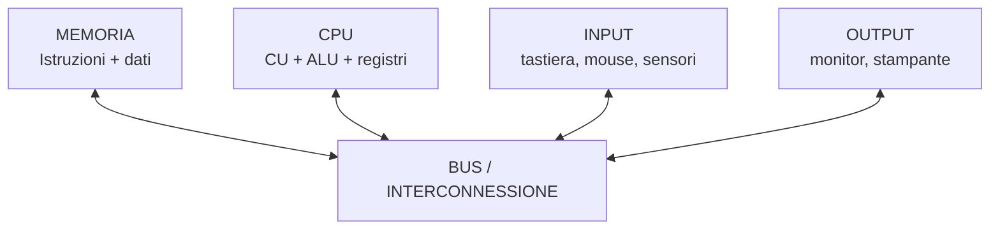

### Il concetto di programma memorizzato

Prima dell'affermazione del modello di programma memorizzato, dati e istruzioni potevano essere gestiti in modo più separato.

Nel modello di Von Neumann:

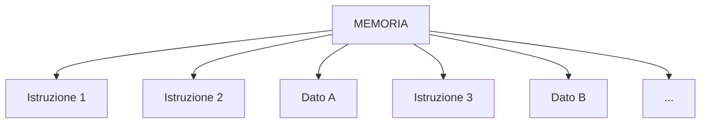

La CPU legge dalla memoria sia le istruzioni sia i dati.

### Un limite del modello di Von Neumann

CPU e memoria comunicano attraverso un sistema condiviso di trasferimento delle informazioni.

Se la CPU è molto veloce ma la memoria non riesce a fornire dati e istruzioni alla stessa velocità, la CPU può rimanere in attesa.

Questo problema è spesso indicato come **collo di bottiglia di Von Neumann**.

---

## 2.2 La CPU

La **Central Processing Unit (CPU)** è l'unità che interpreta ed esegue le istruzioni dei programmi.

Le sue parti fondamentali sono:

| Componente | Funzione |
|---|---|
| **Unità di controllo (CU)** | Coordina l'esecuzione delle istruzioni |
| **ALU** | Esegue operazioni aritmetiche e logiche |
| **Registri** | Memorizzano temporaneamente dati, indirizzi e informazioni di controllo |
| **Clock** | Sincronizza le operazioni |
| **Cache** | Mantiene vicini alla CPU dati e istruzioni utilizzati frequentemente |

Schema semplificato:

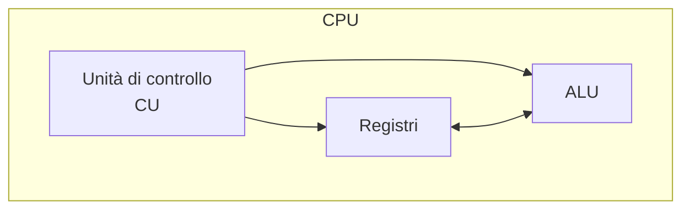

---

## 2.3 La memoria

La memoria permette di conservare:

- istruzioni;
- dati;
- risultati intermedi.

Si distingue principalmente tra:

- **memoria centrale**, direttamente utilizzata durante l'elaborazione;
- **memoria secondaria**, destinata alla conservazione permanente.

### Gerarchia della memoria

In generale:

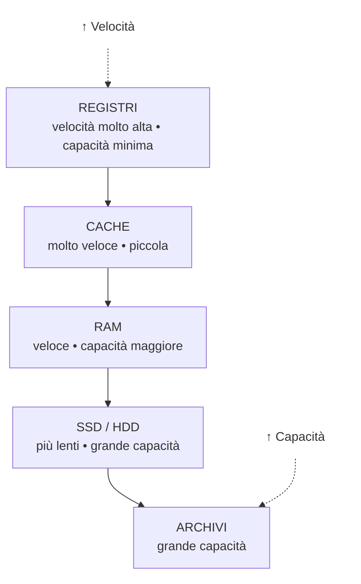

Avvicinandosi alla CPU:

- aumenta la velocità;
- diminuisce generalmente la capacità;
- aumenta il costo per bit.

---

## 2.4 Il sistema di input/output

Il sistema **I/O (Input/Output)** permette al computer di comunicare con l'esterno.

Esempi:

- tastiera → input;
- mouse → input;
- monitor → output;
- stampante → output;
- disco → input/output;
- scheda di rete → input/output.

Le periferiche non comunicano necessariamente direttamente con la CPU: spesso utilizzano **controller** e **interfacce** che gestiscono il trasferimento dei dati.

---

## 2.5 I bus

Un **bus** è un insieme di linee e segnali utilizzati per trasferire informazioni tra componenti del sistema.

Tradizionalmente si distinguono:

| Bus | Trasporta |
|---|---|
| **Bus dati** | Dati |
| **Bus indirizzi** | Indirizzi delle celle di memoria o delle risorse |
| **Bus di controllo** | Segnali di controllo e sincronizzazione |

Schema:

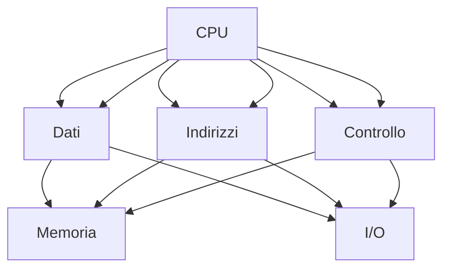

---

# 3. La CPU
## Approfondimento: come lavora realmente un processore

La CPU moderna non è semplicemente una ALU collegata a una memoria. È un sistema complesso nel quale diverse unità possono lavorare contemporaneamente.

Un processore può avere più **core**. Ogni core dispone di proprie risorse di esecuzione e può eseguire un flusso di istruzioni indipendente dagli altri core. Alcuni livelli di cache possono invece essere condivisi.

### Core e thread

È importante distinguere:

- **core**: unità fisica di elaborazione;
- **thread hardware**: flusso logico di esecuzione che può essere gestito dal core;
- **processo**: programma in esecuzione gestito dal sistema operativo;
- **thread software**: unità di esecuzione gestita dal programma/sistema operativo.

Avere più core non significa automaticamente ottenere un'accelerazione proporzionale: il programma deve poter sfruttare il parallelismo e il sistema operativo deve poter distribuire il lavoro.

### Frequenza, IPC e prestazioni

La frequenza indica quante oscillazioni del clock avvengono in un secondo, ma non dice quante istruzioni vengono completate a ogni ciclo.

Una semplificazione utile è:

\[
prestazioni \propto frequenza 	imes IPC
\]

dove **IPC** significa *Instructions Per Cycle*.

L'IPC effettivo dipende dall'architettura e dal programma. Cache miss, salti, dipendenze tra istruzioni e attese per la memoria possono ridurlo.

### Ampiezza del processore

Termini come **32 bit** e **64 bit** non indicano semplicemente la velocità del processore. Descrivono caratteristiche dell'architettura, tra cui la dimensione di registri e operandi e, in base all'ISA e all'implementazione, lo spazio di indirizzamento disponibile.

Per questo non è corretto dire:

> "un processore a 64 bit è il doppio più veloce di uno a 32 bit".

Il numero di bit riguarda principalmente il modello di elaborazione e di indirizzamento, non una misura diretta della velocità.


## 3.1 Architettura di un processore

Un processore moderno contiene molti componenti, ma per comprenderne il funzionamento possiamo partire da:

- **ALU (Arithmetic Logic Unit)**;
- **Control Unit (CU)**;
- **registri**;
- **clock**;
- **cache**;
- unità specializzate, ad esempio per operazioni vettoriali o in virgola mobile.

### ALU

L'ALU esegue operazioni come:

- somma;
- sottrazione;
- confronti;
- AND;
- OR;
- XOR;
- NOT;
- operazioni di shift.

Esempio:

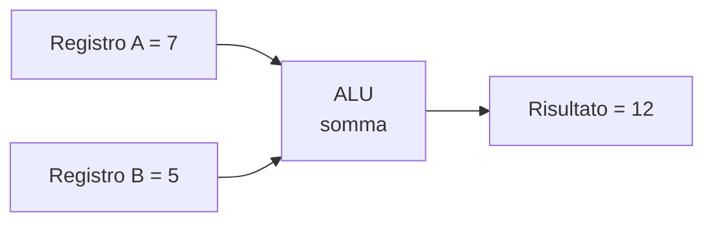

---

## 3.2 L'unità di controllo

La **Control Unit** coordina l'attività della CPU.

In particolare:

1. recupera l'istruzione;
2. la interpreta;
3. determina quali operazioni devono essere eseguite;
4. coordina registri, ALU, memoria e altre unità.

Non "calcola" direttamente il risultato di una somma: stabilisce come devono collaborare i componenti che la eseguono.

---

## 3.3 Il clock

Il **clock** è un segnale periodico che sincronizza le operazioni del processore.

La frequenza viene misurata in **hertz (Hz)**.

| Frequenza | Significato |
|---:|---|
| 1 Hz | 1 ciclo al secondo |
| 1 MHz | 1 milione di cicli/s |
| 1 GHz | 1 miliardo di cicli/s |

Se un clock funziona a:

```text
3 GHz
```

significa che produce circa:

```text
3.000.000.000 cicli al secondo
```

### Attenzione

> Una CPU con frequenza maggiore non è necessariamente più veloce in ogni situazione.

Le prestazioni dipendono anche da:

- architettura;
- numero di core;
- IPC (Instructions Per Cycle);
- cache;
- pipeline;
- memoria;
- tipo di programma;
- parallelismo.

---

## 3.4 I registri

I **registri** sono piccole memorie estremamente veloci integrate nella CPU.

Contengono informazioni necessarie all'esecuzione delle istruzioni.

### Alcuni registri importanti

| Registro | Funzione |
|---|---|
| **PC / Program Counter** | Contiene l'indirizzo della prossima istruzione |
| **IR / Instruction Register** | Contiene l'istruzione corrente |
| **MAR** | Contiene l'indirizzo della memoria da utilizzare |
| **MDR/MBR** | Contiene il dato trasferito da/verso la memoria |
| **Accumulator** | Utilizzato in alcune architetture per risultati intermedi |
| **Registri generali** | Contengono dati e risultati temporanei |
| **PSW / Flags** | Contengono informazioni sullo stato del processore |

I nomi e l'organizzazione possono variare a seconda dell'architettura.

---

## 3.5 Velocità di elaborazione

Non esiste una singola misura sufficiente per descrivere le prestazioni di una CPU.

| Parametro | Che cosa indica |
|---|---|
| Frequenza | Cicli di clock al secondo |
| IPC | Istruzioni completate mediamente per ciclo |
| Numero di core | Numero di unità di elaborazione indipendenti |
| Cache | Capacità di conservare dati vicini al processore |
| Ampiezza registri | Dimensione dei dati elaborabili direttamente |
| Pipeline | Possibilità di sovrapporre fasi di istruzioni |
| Bus/interconnessioni | Velocità di trasferimento dei dati |

Una relazione semplificata può essere:

```text
prestazioni teoriche ≈ frequenza × IPC
```

ma nella pratica il risultato dipende anche da memoria, cache, branch, I/O e dal programma eseguito.

---

# 4. I bus
## Approfondimento: banda e latenza

Quando si parla di prestazioni di un collegamento bisogna distinguere almeno due concetti:

- **banda**: quantità di dati trasferibile per unità di tempo;
- **latenza**: tempo necessario prima che un'operazione produca o inizi a produrre il risultato.

Un collegamento può avere una banda elevata ma una latenza non trascurabile. Per questo "più GB/s" e "risposta più rapida" non sono sempre sinonimi.

### Trasferimento sincrono e asincrono

In un sistema sincrono le operazioni sono coordinate da un riferimento temporale comune. In un sistema asincrono la comunicazione utilizza meccanismi diversi per coordinare mittente e destinatario.

I protocolli moderni introducono inoltre:

- pacchetti;
- controllo degli errori;
- code;
- arbitraggio;
- meccanismi di flow control;
- collegamenti punto-punto.

Quindi il semplice modello di "fili paralleli" è utile per introdurre il concetto, ma non descrive da solo le interconnessioni moderne.

### Perché il bus può diventare un collo di bottiglia?

Se più componenti richiedono contemporaneamente l'accesso a una risorsa condivisa, le richieste devono essere coordinate. Questo introduce attese.

Per migliorare le prestazioni si possono utilizzare:

- maggiore frequenza;
- maggiore ampiezza;
- più trasferimenti per ciclo;
- cache;
- collegamenti dedicati;
- parallelismo;
- trasferimenti DMA per alcune periferiche.

Il **DMA (Direct Memory Access)** permette a una periferica di trasferire dati verso o dalla memoria senza richiedere alla CPU di gestire ogni singolo byte trasferito. La CPU configura l'operazione e viene normalmente informata al termine o in presenza di condizioni specifiche.


## 4.1 Organizzazione dei bus

Un sistema di elaborazione deve trasferire continuamente:

- dati;
- indirizzi;
- comandi;
- segnali di sincronizzazione.

Tradizionalmente il bus di sistema viene rappresentato come:

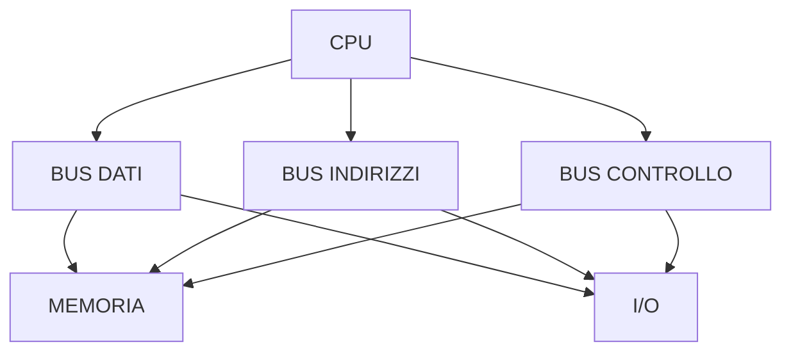

Nei sistemi moderni l'organizzazione fisica è molto più complessa: molte connessioni sono realizzate tramite interconnessioni punto-punto e controller integrati nel processore.

---

## 4.2 Bus dati

Il **bus dati** trasferisce i dati.

La sua ampiezza indica quanti bit possono essere trasferiti in parallelo in una determinata operazione.

Esempio:

```text
bus dati a 32 bit
↓
32 bit trasferibili in parallelo
```

Un bus più ampio può aumentare la quantità di dati trasferibile per operazione, ma le prestazioni dipendono anche dalla frequenza e dall'organizzazione del sistema.

---

## 4.3 Bus indirizzi

Il bus indirizzi identifica la posizione della risorsa da raggiungere.

Se un sistema utilizza `n` bit di indirizzo, il numero teorico di indirizzi distinti è:

\[
2^n
\]

Per esempio:

| Bus indirizzi | Indirizzi teorici |
|---:|---:|
| 8 bit | 256 |
| 16 bit | 65.536 |
| 20 bit | 1.048.576 |
| 32 bit | 4.294.967.296 |

Se ogni indirizzo identifica un byte, un bus indirizzi a 32 bit permette di indirizzare teoricamente fino a **4 GiB** di spazio di indirizzamento.

> Il limite effettivo della memoria utilizzabile può essere diverso per ragioni architetturali e software.

---

## 4.4 Bus di controllo

Trasporta segnali utilizzati per coordinare le operazioni.

Esempi:

- lettura;
- scrittura;
- interrupt;
- clock;
- reset;
- segnali di sincronizzazione.

---

## 4.5 Ottimizzazione delle prestazioni del bus

Le prestazioni di un collegamento dipendono, tra gli altri fattori, da:

- frequenza;
- ampiezza;
- numero di trasferimenti per ciclo;
- protocollo;
- latenza;
- parallelismo;
- modalità di arbitraggio.

Una grandezza utile è la **larghezza di banda**.

In forma semplificata:

\[
B \approx \frac{ampiezza\ del\ bus \times trasferimenti/s}{8}
\]

Esempio teorico:

```text
bus = 64 bit
trasferimenti = 100 milioni/s

64 × 100.000.000 = 6,4 Gbit/s

6,4 / 8 = 0,8 GB/s
```

La banda reale può essere inferiore a quella teorica a causa dell'overhead del protocollo e dei tempi di attesa.

---

# 5. La memoria cache
## Approfondimento: perché la cache funziona

La cache funziona perché i programmi reali non accedono alla memoria in modo completamente casuale.

La **località temporale** significa che un'informazione utilizzata recentemente ha una buona probabilità di essere riutilizzata.

La **località spaziale** significa che, quando un programma accede a un indirizzo, è probabile che utilizzi anche indirizzi vicini.

Un esempio tipico è un ciclo che percorre un array:

```text
A[0]
A[1]
A[2]
A[3]
A[4]
...
```

Gli elementi dell'array sono memorizzati in posizioni vicine. La cache può quindi trasferire un intero blocco, detto **cache line**, invece del solo dato richiesto.

### Hit rate e miss rate

Il rapporto tra accessi soddisfatti dalla cache e accessi complessivi è il **hit rate**:

\[
hit\ rate = rac{cache\ hit}{accessi\ totali}
\]

Il **miss rate** è:

\[
miss\ rate = 1 - hit\ rate
\]

Anche un piccolo aumento del miss rate può avere un impatto significativo quando la differenza di latenza tra cache e memoria principale è grande.

### Cache e multicore

Con più core possono esistere cache private e cache condivise. Se due core possiedono copie dello stesso dato, il sistema deve mantenere una forma di **coerenza della cache**.

Questo introduce protocolli e meccanismi hardware specifici. L'obiettivo è fare in modo che i core non lavorino indefinitamente su copie incoerenti dello stesso dato.


## 5.1 Perché serve la cache?

La CPU può elaborare dati molto più velocemente rispetto alla memoria principale.

La **cache** riduce il tempo medio necessario per ottenere dati e istruzioni utilizzati frequentemente.

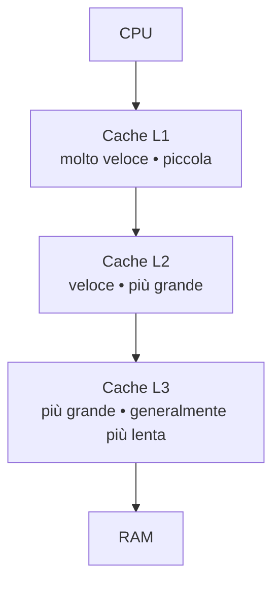

---

## 5.2 Funzioni della cache

La cache sfrutta principalmente due proprietà:

### Località temporale

Se un dato è stato utilizzato recentemente, è probabile che venga utilizzato nuovamente.

Esempio:

```text
x = x + 1
x = x * 2
x = x - 3
```

La variabile `x` viene utilizzata ripetutamente.

### Località spaziale

Se viene utilizzato un indirizzo di memoria, è probabile che vengano utilizzati anche indirizzi vicini.

Questo è particolarmente importante nell'esecuzione sequenziale delle istruzioni.

---

## 5.3 Cache hit e cache miss

Quando la CPU cerca un dato:

- **cache hit** → il dato è presente nella cache;
- **cache miss** → il dato non è presente e deve essere recuperato da un livello più lento.

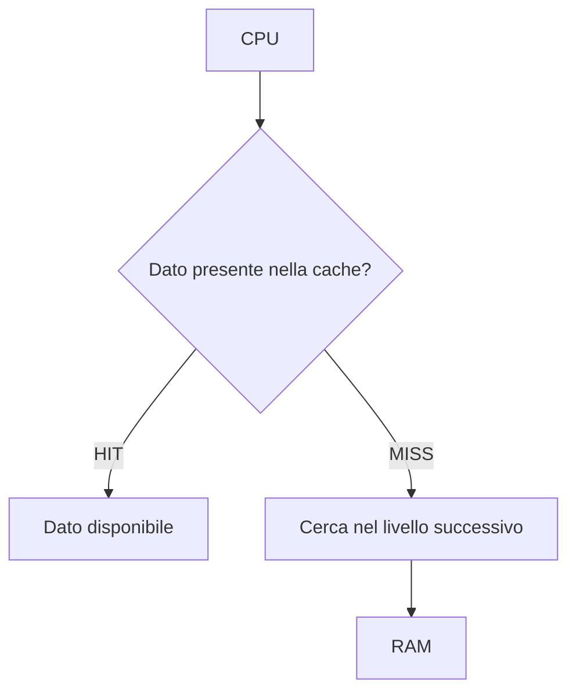

---

## 5.4 Gestione della cache

La cache deve stabilire:

- quali dati conservare;
- dove conservarli;
- quando sostituirli;
- come mantenere coerenti eventuali copie.

Nei processori moderni esistono spesso più livelli:

| Livello | Caratteristiche generali |
|---|---|
| **L1** | Molto veloce, capacità ridotta, spesso separata per dati/istruzioni |
| **L2** | Più grande, leggermente più lenta |
| **L3** | Ancora più grande, spesso condivisa tra più core |

Le dimensioni e l'organizzazione dipendono dal processore.

---

# 6. La memoria centrale
## Approfondimento: indirizzi e celle di memoria

La memoria centrale può essere vista come un enorme insieme di posizioni numerate. Il processore utilizza un indirizzo per identificare la posizione da cui leggere o nella quale scrivere.

È importante distinguere:

- **indirizzo** → identifica una posizione;
- **contenuto** → valore memorizzato nella posizione;
- **dimensione del dato** → numero di byte coinvolti nell'operazione.

### RAM dinamica

La DRAM memorizza l'informazione utilizzando celle che richiedono un meccanismo di mantenimento periodico. Questo spiega, a livello concettuale, perché la DRAM è diversa dalla SRAM utilizzata nelle cache.

La SRAM è più veloce ma richiede più transistor per cella ed è quindi meno densa e più costosa.

### Tempo di accesso e ciclo di memoria

Quando si valuta una memoria non bisogna considerare soltanto la capacità. Sono importanti anche:

- latenza;
- banda;
- frequenza;
- organizzazione dei canali;
- numero di trasferimenti per ciclo.

La memoria principale moderna è inoltre organizzata in **canali**, banchi e altre strutture interne che permettono di aumentare il parallelismo dei trasferimenti.


## 6.1 Caratteristiche

La memoria centrale è principalmente costituita dalla **RAM**.

Le sue caratteristiche principali sono:

- accesso relativamente rapido;
- accesso diretto alle celle;
- volatilità della RAM tradizionale;
- capacità misurata in byte e multipli;
- collegamento diretto con il sottosistema di memoria.

### Unità di misura

| Unità | Valore |
|---|---:|
| 1 byte | 8 bit |
| 1 KiB | 1024 byte |
| 1 MiB | 1024 KiB |
| 1 GiB | 1024 MiB |
| 1 TiB | 1024 GiB |

> Nei dispositivi commerciali i produttori possono usare anche multipli decimali: 1 GB = 1.000.000.000 byte.

---

## 6.2 Organizzazione della memoria

La memoria può essere vista come un insieme di celle indirizzabili.

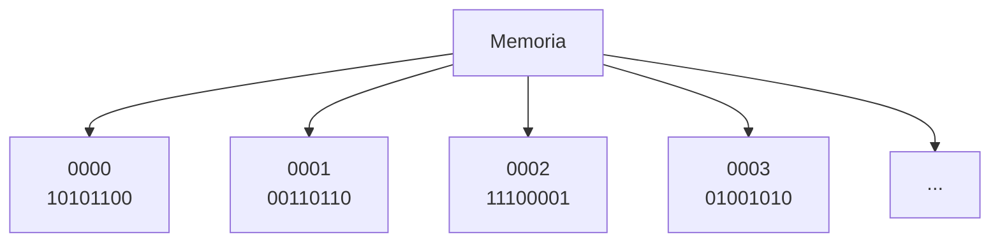

Ogni cella è identificata da un **indirizzo**.

La CPU utilizza l'indirizzo per specificare quale informazione leggere o modificare.

---

## 6.3 Operazioni sulla memoria

Le operazioni fondamentali sono:

### Lettura

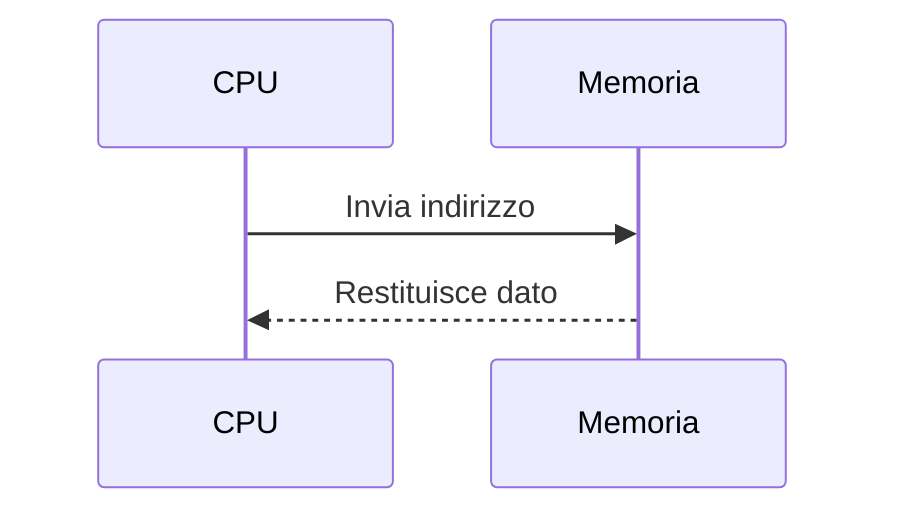

### Scrittura


---

## 6.4 Tipologie di memoria

### RAM

La RAM è una memoria:

- ad accesso casuale/diretto;
- volatile;
- riscrivibile.

Le principali famiglie storiche sono:

| Tipo | Caratteristica |
|---|---|
| **SRAM** | Molto veloce, costosa, usata soprattutto per cache |
| **DRAM** | Più densa ed economica, utilizzata per la memoria principale |

Le RAM moderne utilizzano varianti della famiglia **DDR SDRAM**.

---

## 6.5 ROM e memorie non volatili

Il termine ROM indica una famiglia di memorie non volatili.

| Tipo | Caratteristica |
|---|---|
| ROM | Scritta in fase di produzione |
| PROM | Programmabile una sola volta |
| EPROM | Cancellabile e riprogrammabile, storicamente tramite UV |
| EEPROM | Cancellabile e riprogrammabile elettricamente |
| Flash | Evoluzione della memoria non volatile elettricamente riscrivibile |

Le memorie flash sono oggi utilizzate in SSD, chiavette USB, schede di memoria e firmware.

---

# 7. Le memorie secondarie
## Approfondimento: perché esistono più tecnologie di storage

Nessuna tecnologia di memoria secondaria è ottimale per tutti gli utilizzi.

Un archivio può privilegiare:

- costo per terabyte;
- velocità;
- affidabilità;
- consumo energetico;
- resistenza agli urti;
- durata nel tempo;
- facilità di sostituzione.

### HDD e SSD

L'HDD utilizza la rotazione di piatti magnetici e il movimento di una testina. La latenza è quindi influenzata anche da fenomeni meccanici.

L'SSD utilizza invece memoria flash. L'assenza di parti mobili permette tempi di accesso molto inferiori.

Tuttavia "SSD = indistruttibile" è una conclusione errata: anche un SSD può guastarsi e i dati importanti devono essere sottoposti a backup.

### RAID e backup

RAID e backup risolvono problemi differenti.

**RAID** lavora sulla disponibilità e/o sulle prestazioni di un insieme di dischi.

**Backup** significa avere una copia separata dei dati, possibilmente su un sistema indipendente.

Un RAID può quindi continuare a funzionare dopo il guasto di un disco, ma non protegge necessariamente da:

- cancellazione accidentale;
- ransomware;
- corruzione logica;
- errore umano;
- incendio o furto dell'intero sistema.

### Memoria virtuale e isolamento

La memoria virtuale ha anche un'importante funzione di **isolamento**: ogni processo può vedere uno spazio di indirizzamento virtuale proprio, mentre il sistema operativo e l'hardware di gestione della memoria traducono gli indirizzi virtuali in indirizzi fisici.

Questo meccanismo è fondamentale per sicurezza, stabilità e multitasking.


Le memorie secondarie consentono di conservare dati anche quando il computer viene spento.

| Caratteristica | Memoria centrale | Memoria secondaria |
|---|---|---|
| Volatilità | Generalmente sì | Generalmente no |
| Velocità | Maggiore | Minore |
| Capacità | Inferiore | Maggiore |
| Costo/GB | Maggiore | Inferiore |
| Utilizzo | Programmi e dati in esecuzione | Conservazione permanente |

---

## 7.1 Evoluzione delle memorie secondarie

Una possibile linea evolutiva è:

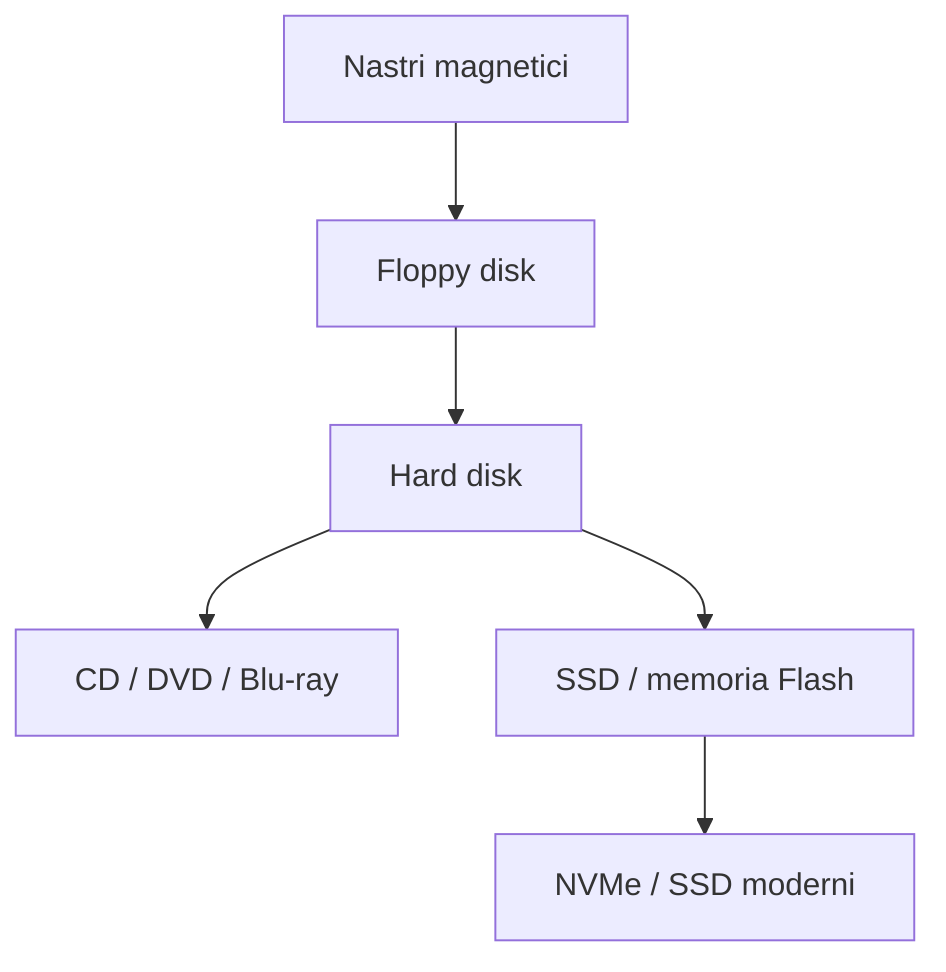

---

## 7.2 Memorie magnetiche

### Hard Disk Drive — HDD

Un HDD utilizza:

- piatti magnetici;
- testine di lettura/scrittura;
- motore;
- elettronica di controllo.

Schema concettuale:

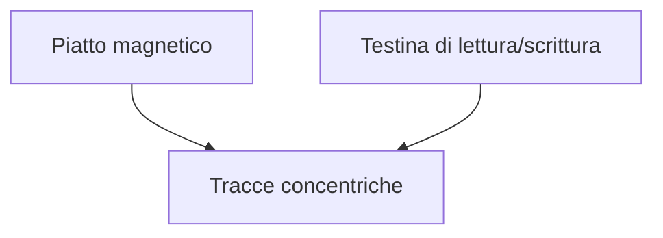

### Vantaggi

- grande capacità;
- costo per GB contenuto;
- adatti all'archiviazione.

### Svantaggi

- parti meccaniche;
- maggiore latenza;
- più sensibili agli urti rispetto agli SSD.

---

## 7.3 Memorie Flash

La memoria flash è **non volatile** e non utilizza parti meccaniche in movimento.

È presente in:

- SSD;
- chiavette USB;
- schede SD;
- smartphone;
- dispositivi embedded.

### Vantaggi rispetto agli HDD

| Flash/SSD | HDD |
|---|---|
| Nessuna parte meccanica | Parti meccaniche |
| Latenza molto bassa | Latenza maggiore |
| Silenziosa | Può produrre rumore |
| Maggiore resistenza agli urti | Più sensibile agli urti |
| Consumi generalmente inferiori | Maggiori consumi in molte condizioni |

### Limite importante

Le celle flash hanno un numero finito di cicli di programmazione/cancellazione.

I controller degli SSD utilizzano tecniche come:

- wear leveling;
- gestione dei blocchi;
- garbage collection;
- over-provisioning;
- correzione degli errori.

---

## 7.4 Memorie ottiche

Utilizzano un laser per leggere e, in alcuni casi, scrivere informazioni.

| Supporto | Capacità tipica |
|---|---:|
| CD | circa 700 MB |
| DVD | circa 4,7 GB per strato |
| Blu-ray | circa 25 GB per strato |

Oggi hanno un ruolo molto meno centrale rispetto al passato.

---

# 7.5 RAID

**RAID (Redundant Array of Independent Disks)** indica una tecnica per organizzare più unità di memoria in modo coordinato.

Gli obiettivi possono essere:

- aumentare le prestazioni;
- aumentare l'affidabilità;
- garantire ridondanza;
- combinare più obiettivi.

> RAID non sostituisce un backup.

### RAID 0

I dati vengono distribuiti tra più dischi.

```text
Dato: A B C D E F

Disco 1: A   C   E
Disco 2: B   D   F
```

**Vantaggio:** prestazioni.

**Svantaggio:** nessuna ridondanza; se si rompe un disco, si può perdere l'intero insieme di dati.

### RAID 1

Mirroring:

```text
Disco 1: A B C D
Disco 2: A B C D
```

**Vantaggio:** ridondanza.

**Svantaggio:** capacità utile circa pari a quella di un solo disco.

### RAID 5

Utilizza distribuzione dei dati e parità.

Con almeno 3 dischi può tollerare il guasto di un disco.

### RAID 6

Utilizza doppia parità e può tollerare il guasto di due dischi.

### Tabella RAID

| Livello | Tecnica | Min. dischi | Ridondanza | Obiettivo |
|---|---|---:|---|---|
| RAID 0 | Striping | 2 | No | Prestazioni |
| RAID 1 | Mirroring | 2 | Sì | Affidabilità |
| RAID 5 | Striping + parità | 3 | Sì | Equilibrio |
| RAID 6 | Striping + doppia parità | 4 | Sì | Maggiore tolleranza |
| RAID 10 | Mirroring + striping | 4 | Sì | Prestazioni + ridondanza |

---

# 7.6 Memoria virtuale

La **memoria virtuale** permette a un sistema operativo di utilizzare parte dello spazio di una memoria secondaria come supporto per estendere lo spazio di memoria apparentemente disponibile ai processi.

Nei sistemi moderni è tipicamente basata su **pagine**.

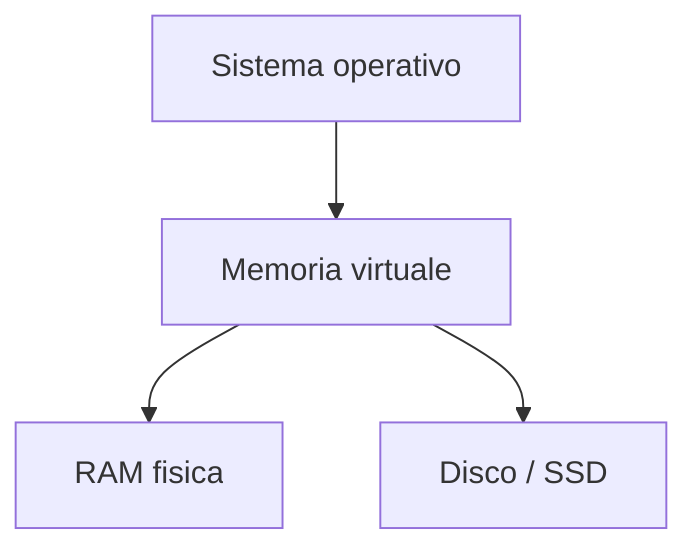

Quando una pagina richiesta non è presente in RAM si può verificare un **page fault**.

Il sistema operativo recupera quindi la pagina dalla memoria secondaria.

> La memoria virtuale è molto più lenta della RAM. Non deve essere confusa con un semplice "aumento della RAM".

---

# 7.7 Memorie a confronto

| Tecnologia | Volatile | Parti meccaniche | Velocità | Capacità | Utilizzo tipico |
|---|---|---|---|---|---|
| Registri | Sì | No | ★★★★★ | Minima | CPU |
| Cache | Sì | No | ★★★★★ | Molto piccola | CPU |
| RAM | Sì | No | ★★★★ | Media/alta | Programmi in esecuzione |
| SSD NVMe | No | No | ★★★ | Alta | Archiviazione |
| SSD SATA | No | No | ★★ | Alta | Archiviazione |
| HDD | No | Sì | ★ | Molto alta | Archiviazione |
| Ottico | No | No | ★ | Media | Distribuzione/archivio |

---

# 8. Le periferiche
## Approfondimento: controller e driver

Una periferica non è normalmente controllata dalla CPU attraverso semplici istruzioni generiche. Tra sistema operativo e dispositivo intervengono spesso:

1. **driver**;
2. **controller**;
3. **interfaccia hardware**;
4. **protocollo di comunicazione**.

Il **driver** è il componente software che permette al sistema operativo di utilizzare una specifica classe o modello di dispositivo.

Il **controller** è invece una componente hardware/elettronica che gestisce il funzionamento del dispositivo o dell'interfaccia.

### Interrupt

Le periferiche devono poter segnalare alla CPU che un evento richiede attenzione.

Gli **interrupt** permettono a un dispositivo di richiamare l'attenzione del processore.

Per esempio:

```text
tastiera → viene premuto un tasto
        → controller genera un evento
        → interrupt
        → CPU esegue il gestore appropriato
```

In questo modo la CPU non deve interrogare continuamente la periferica chiedendo se è successo qualcosa.

### Polling

Nel **polling**, invece, la CPU o il software verifica periodicamente lo stato della periferica.

| Metodo | Caratteristica |
|---|---|
| Polling | Il processore controlla periodicamente |
| Interrupt | La periferica segnala quando necessario |
| DMA | Il trasferimento di blocchi può essere eseguito senza coinvolgere la CPU per ogni singolo dato |


Una **periferica** è un dispositivo che permette al sistema di elaborazione di interagire con l'esterno.

## 8.1 Periferiche di input

Forniscono dati al computer.

| Periferica | Funzione |
|---|---|
| Tastiera | Inserimento caratteri e comandi |
| Mouse | Puntamento e selezione |
| Scanner | Acquisizione immagini/documenti |
| Microfono | Acquisizione audio |
| Webcam | Acquisizione immagini/video |
| Sensore | Acquisizione di grandezze fisiche |

---

## 8.2 Periferiche di output

Presentano informazioni all'esterno.

| Periferica | Funzione |
|---|---|
| Monitor | Visualizzazione |
| Stampante | Stampa |
| Altoparlanti | Riproduzione audio |
| Proiettore | Visualizzazione su grande schermo |

---

## 8.3 Periferiche di input/output

Possono sia ricevere sia trasmettere dati.

| Periferica | Input | Output |
|---|---|---|
| SSD/HDD | Sì | Sì |
| Scheda di rete | Sì | Sì |
| Modem | Sì | Sì |
| Touchscreen | Sì | Sì |
| Scheda audio | Sì | Sì |

---

# 9. Gli standard di interfacciamento alle periferiche
## Approfondimento: interfaccia, protocollo e connettore

Questi tre concetti non sono sinonimi.

- **Connettore**: elemento fisico attraverso il quale si realizza il collegamento.
- **Interfaccia**: definisce come due componenti possono comunicare.
- **Protocollo**: insieme di regole che stabiliscono come devono essere scambiate le informazioni.

Un singolo connettore può supportare più protocolli o modalità operative. Per esempio, USB-C descrive soprattutto un tipo di connettore e non identifica da solo una singola velocità o un singolo protocollo.

### Esempio: USB-C

La presenza di una porta USB-C non permette da sola di dedurre:

- la velocità massima;
- il supporto video;
- la potenza di alimentazione;
- la compatibilità Thunderbolt.

È quindi necessario verificare le specifiche del dispositivo e della porta.

### Interfacce seriali e parallele

Storicamente le interfacce potevano trasferire più bit contemporaneamente attraverso linee parallele. Le interfacce seriali trasferiscono invece i bit secondo una sequenza temporale.

Le moderne interfacce seriali ad alta velocità hanno però raggiunto prestazioni molto elevate grazie a frequenze, codifiche e tecniche di comunicazione sofisticate.


Un'interfaccia definisce modalità e regole attraverso cui due componenti comunicano.

Gli standard permettono di stabilire:

- connettori;
- segnali elettrici;
- protocolli;
- velocità;
- modalità di trasferimento;
- gestione degli errori;
- identificazione dei dispositivi.

---

## 9.1 Collegamento con la CPU

Il collegamento tra CPU e altre componenti avviene tramite sistemi di interconnessione.

Esempi moderni:

- PCI Express;
- interfacce interne del processore;
- controller integrati;
- bus e collegamenti dedicati.

### PCI Express

PCIe utilizza collegamenti organizzati in **lane**.

Una connessione può essere indicata come:

```text
x1
x4
x8
x16
```

Il numero indica il numero di lane utilizzate.

---

## 9.2 Collegamento con le memorie di massa

### SATA

Utilizzato soprattutto per:

- HDD;
- SSD SATA;
- unità ottiche.

### NVMe

È un protocollo progettato per sfruttare meglio le caratteristiche delle memorie flash moderne.

Gli SSD NVMe comunicano generalmente tramite **PCI Express**.

Confronto:

| SATA | NVMe |
|---|---|
| Protocollo storico per storage | Progettato per storage flash moderno |
| Banda inferiore | Banda maggiore |
| Latenza generalmente superiore | Latenza generalmente inferiore |
| Diffuso con SSD SATA | Diffuso con SSD M.2 PCIe |

> **M.2** identifica principalmente un formato fisico; non significa automaticamente NVMe.

---

## 9.3 Collegamento con il video

I principali standard moderni includono:

- HDMI;
- DisplayPort;
- USB-C con modalità video supportate.

### HDMI

Molto diffuso per:

- monitor;
- TV;
- proiettori;
- audio/video digitale.

### DisplayPort

Molto diffuso nel collegamento tra computer e monitor.

Può supportare elevate risoluzioni e frequenze di aggiornamento e più monitor tramite tecnologie specifiche.

---

## 9.4 Altri collegamenti

| Standard | Utilizzo |
|---|---|
| USB | Periferiche, dati, alimentazione |
| Thunderbolt | Dati, video e periferiche ad alta velocità |
| Ethernet | Rete cablata |
| Wi-Fi | Rete wireless |
| Bluetooth | Collegamenti wireless a breve distanza |
| I²C | Comunicazione tra circuiti integrati |
| SPI | Comunicazione seriale tra componenti elettronici |
| UART | Comunicazione seriale asincrona |

---

# 10. Il ciclo di esecuzione della CPU
## Approfondimento: istruzioni, registri e controllo del flusso

Il ciclo macchina è un modello concettuale. Una CPU reale può suddividere le operazioni in un numero diverso di stadi.

Consideriamo una semplice istruzione:

```text
ADD R1, R2, R3
```

Possiamo interpretarla concettualmente come:

> calcola R2 + R3 e memorizza il risultato in R1.

La CPU deve quindi:

1. trovare l'istruzione;
2. capire quale operazione rappresenta;
3. leggere gli operandi;
4. eseguire il calcolo;
5. memorizzare il risultato.

### Salti e Program Counter

Il PC normalmente avanza verso la prossima istruzione, ma non sempre.

Con un'istruzione di salto:

```text
if condizione vera:
    PC ← indirizzo destinazione
```

il normale flusso sequenziale viene modificato.

Questo è il motivo per cui le istruzioni di salto hanno un ruolo importante nella gestione della pipeline.


## 10.1 Il linguaggio macchina

La CPU non esegue direttamente programmi scritti in linguaggi come:

- C;
- Java;
- Python;
- PHP.

Questi linguaggi devono essere tradotti o interpretati secondo il relativo modello di esecuzione.

A livello hardware la CPU esegue **istruzioni macchina**, codificate in forma binaria.

Un'istruzione può essere concettualmente rappresentata come:

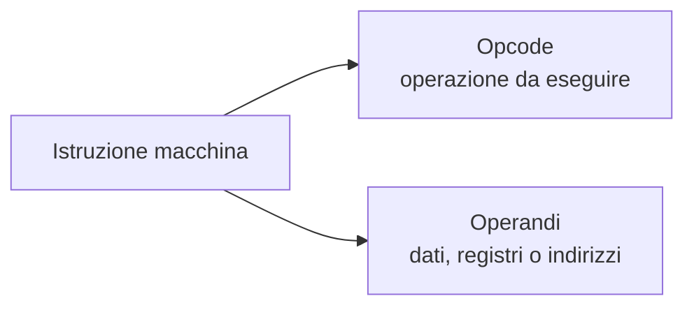

### Opcode

Indica l'operazione da eseguire.

Esempi concettuali:

```text
ADD
LOAD
STORE
JUMP
CMP
```

### Operandi

Indicano i dati, i registri o gli indirizzi coinvolti nell'operazione.

---

## 10.2 Esecuzione dei programmi

Un programma compilato contiene una sequenza di istruzioni macchina.

La CPU esegue ripetutamente un ciclo:

```text
FETCH → DECODE → EXECUTE → MEMORY → WRITE BACK
```

Non tutte le istruzioni utilizzano necessariamente tutte le fasi nello stesso modo.

---

# 10.3 Le fasi del ciclo macchina

## 1. Fetch

La CPU recupera dalla memoria l'istruzione indicata dal **Program Counter (PC)**.

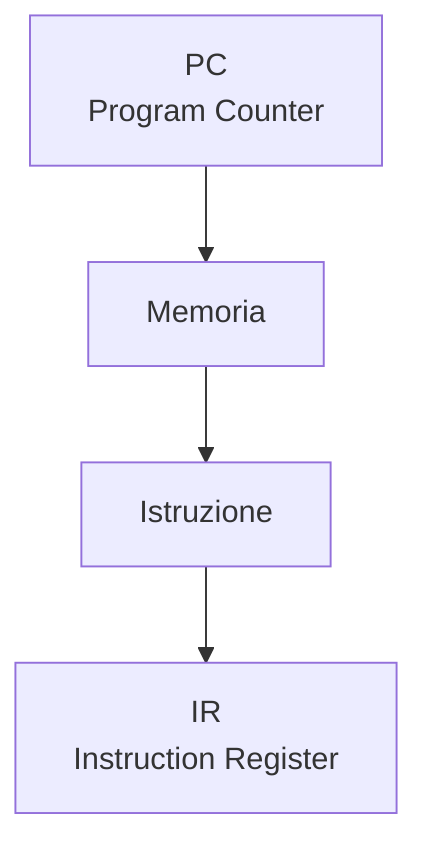

Il PC viene aggiornato per puntare alla prossima istruzione, salvo modifiche dovute a salti o altre istruzioni di controllo.

---

## 2. Decode

L'unità di controllo interpreta l'istruzione.

Vengono identificati:

- tipo di operazione;
- registri coinvolti;
- operandi;
- modalità di indirizzamento.

---

## 3. Execute

La CPU esegue l'operazione.

Esempi:

- somma;
- confronto;
- salto;
- calcolo di un indirizzo;
- operazione logica.

---

## 4. Memory

Se necessario, viene effettuato un accesso alla memoria.

Esempi:

```text
LOAD  → lettura
STORE → scrittura
```

---

## 5. Write Back

Il risultato viene scritto nella destinazione prevista, spesso un registro.

---

## Schema completo

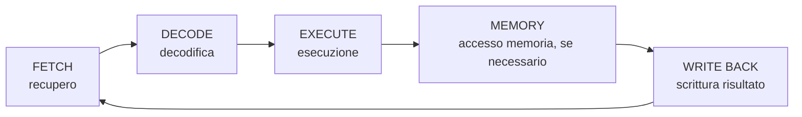

---

# 11. Il pipelining
## Approfondimento: throughput e latenza

La pipeline va compresa distinguendo **latenza** e **throughput**.

La latenza è il tempo necessario affinché una singola istruzione attraversi tutti gli stadi.

Il throughput indica invece quante istruzioni possono essere completate in un intervallo di tempo.

In una pipeline ideale a 5 stadi, dopo il riempimento della pipeline può essere completata circa un'istruzione per ciclo, anche se ogni singola istruzione richiede più stadi.

### Stalli

Quando una dipendenza impedisce di proseguire, uno stadio può rimanere fermo.

Questa situazione è detta **stall**.

Gli stalli riducono il vantaggio teorico della pipeline.

### Branch prediction

Per ridurre gli effetti dei salti condizionali, i processori moderni possono tentare di prevedere quale sarà il percorso seguito.

Se la previsione è corretta, la pipeline continua a essere alimentata.

Se è errata, alcune istruzioni già caricate devono essere scartate e il processore deve riprendere dal punto corretto.

Questo comportamento viene spesso descritto come **pipeline flush**.


## 11.1 La pipeline

Senza pipeline, la CPU potrebbe completare una istruzione prima di iniziare la successiva.

Con il **pipelining**, le diverse fasi di più istruzioni vengono sovrapposte.

### Senza pipeline

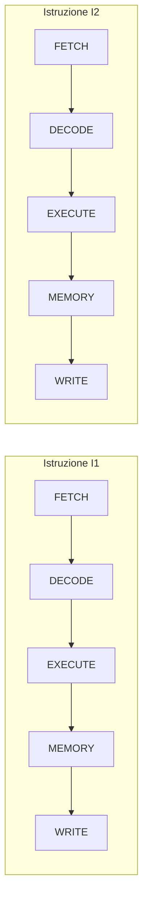

### Con pipeline

```mermaid
gantt
    title Esempio di pipeline a 5 stadi
    dateFormat X
    axisFormat %s
    section I1
    FETCH :i1f, 0, 1
    DECODE :i1d, 1, 1
    EXECUTE :i1e, 2, 1
    MEMORY :i1m, 3, 1
    WRITE :i1w, 4, 1
    section I2
    FETCH :i2f, 1, 1
    DECODE :i2d, 2, 1
    EXECUTE :i2e, 3, 1
    MEMORY :i2m, 4, 1
    WRITE :i2w, 5, 1
    section I3
    FETCH :i3f, 2, 1
    DECODE :i3d, 3, 1
    EXECUTE :i3e, 4, 1
    MEMORY :i3m, 5, 1
    section I4
    FETCH :i4f, 3, 1
    DECODE :i4d, 4, 1
    EXECUTE :i4e, 5, 1
```

L'obiettivo è aumentare il **throughput**, cioè il numero di istruzioni completate nell'unità di tempo.

> La pipeline non rende necessariamente più veloce l'esecuzione della singola istruzione; permette soprattutto di completare più istruzioni in sovrapposizione.

---

## 11.2 Analogia della catena di montaggio

Immaginiamo una fabbrica con cinque operazioni:

```text
Taglio → Assemblaggio → Verniciatura → Controllo → Imballaggio
```

Senza pipeline:

```text
Prodotto A: [1][2][3][4][5]
Prodotto B:                 [1][2][3][4][5]
```

Con pipeline:

```text
Prodotto A: [1][2][3][4][5]
Prodotto B:    [1][2][3][4][5]
Prodotto C:       [1][2][3][4][5]
```

Le fasi lavorano contemporaneamente su prodotti diversi.

---

# 11.3 Problemi di gestione della pipeline

Le istruzioni non sono sempre indipendenti.

I principali problemi sono detti **hazard**.

## Data hazard

Un'istruzione dipende dal risultato di una precedente.

```text
I1: R1 = R2 + R3
I2: R4 = R1 + R5
```

I2 ha bisogno di `R1`, prodotto da I1.

### Soluzioni

- forwarding;
- stallo;
- riordinamento delle istruzioni.

---

## Control hazard

Si verifica con salti e istruzioni condizionali.

```text
if (condizione)
    salta a L1
```

La CPU potrebbe aver già caricato istruzioni che non dovranno essere eseguite.

Una soluzione comune è la **branch prediction**.

---

## Structural hazard

Si verifica quando due operazioni richiedono contemporaneamente una risorsa hardware che non può servire entrambe.

### Tabella

| Hazard | Causa | Possibili soluzioni |
|---|---|---|
| Data | Dipendenza tra dati | Forwarding, stalli |
| Control | Salti/branch | Branch prediction |
| Structural | Risorsa hardware condivisa | Risorse aggiuntive, stalli |

---

# 12. Architetture CISC e RISC
## Approfondimento: ISA e microarchitettura

È fondamentale distinguere **ISA** e **microarchitettura**.

L'ISA definisce ciò che il software vede: istruzioni, registri, modalità di indirizzamento e comportamento previsto.

La microarchitettura descrive invece come il processore realizza fisicamente quelle funzionalità.

Due processori possono implementare la stessa ISA ma avere microarchitetture molto diverse e quindi prestazioni differenti.

### CISC e micro-operazioni

Le moderne CPU x86 possono tradurre alcune istruzioni dell'ISA in operazioni interne più semplici, spesso chiamate **micro-operazioni**.

Questo permette di combinare:

- compatibilità con una ISA complessa;
- pipeline;
- esecuzione fuori ordine;
- previsione dei salti;
- parallelismo interno.

### RISC non significa "pochi transistor"

Un'ISA RISC può essere implementata con microarchitetture estremamente complesse. La semplificazione riguarda soprattutto la struttura e la regolarità del set di istruzioni.

Questa distinzione è importante perché evita una contrapposizione troppo semplicistica:

```text
CISC = complesso = lento
RISC = semplice = veloce
```

che non descrive correttamente i processori moderni.


## 12.1 Linguaggio macchina e architettura

Il **set di istruzioni (ISA — Instruction Set Architecture)** definisce il modello che mette in relazione software e processore.

Comprende, tra gli altri elementi:

- istruzioni;
- registri;
- modalità di indirizzamento;
- tipi di dati;
- comportamento delle istruzioni;
- gestione della memoria.

L'ISA è distinta dall'implementazione fisica del processore.

---

# 12.2 CISC

**CISC = Complex Instruction Set Computer**

L'idea tradizionale del CISC è fornire un insieme ampio di istruzioni, alcune delle quali possono essere relativamente complesse.

Caratteristiche tipiche:

- numerose istruzioni;
- istruzioni di lunghezza variabile in molte ISA;
- numerose modalità di indirizzamento;
- alcune istruzioni possono svolgere operazioni articolate.

Un esempio importante è la famiglia **x86**.

> CISC non significa semplicemente "CPU lenta" e RISC non significa semplicemente "CPU veloce": sono caratteristiche dell'ISA e della progettazione, mentre le CPU moderne possono implementare tecniche molto sofisticate.

---

# 12.3 RISC

**RISC = Reduced Instruction Set Computer**

L'approccio RISC punta a un insieme di istruzioni più regolare e semplice da gestire.

Caratteristiche tipiche:

- istruzioni relativamente semplici;
- molte operazioni eseguite sui registri;
- numerosi registri;
- uso frequente del modello load/store;
- istruzioni spesso di lunghezza fissa o più regolare, a seconda dell'ISA;
- progettazione favorevole alla pipeline.

Esempi di ISA RISC:

- ARM;
- RISC-V;
- MIPS;
- Power.

---

## 12.4 Modello load/store

In molte architetture RISC, le operazioni aritmetiche lavorano sui registri.

Per accedere alla memoria vengono utilizzate istruzioni specifiche.

Esempio concettuale:

```text
LOAD  R1, [indirizzo]
LOAD  R2, [indirizzo]

ADD   R3, R1, R2

STORE R3, [indirizzo]
```

La memoria viene quindi utilizzata principalmente tramite:

- **LOAD** → memoria → registro;
- **STORE** → registro → memoria.

---

## 12.5 Confronto CISC e RISC

| Caratteristica | CISC | RISC |
|---|---|---|
| Set di istruzioni | Tradizionalmente ampio | Tradizionalmente più contenuto |
| Complessità istruzioni | Può essere elevata | Generalmente più semplice |
| Lunghezza istruzioni | Spesso variabile | Spesso più regolare |
| Accesso memoria | Può essere integrato in molte istruzioni | Tipicamente concentrato in LOAD/STORE |
| Registri | Dipende dall'ISA | Generalmente numerosi |
| Pipeline | Possibile, ma progettazione complessa | Storicamente favorita dalla regolarità |
| Esempi | x86-64 | ARM, RISC-V |

### Una distinzione importante

Le moderne CPU non sono classificabili in modo semplicistico.

Ad esempio, processori x86 moderni possono tradurre istruzioni complesse in operazioni interne più semplici (**micro-operazioni**), mentre processori RISC moderni possono avere implementazioni molto sofisticate.

Quindi:

> **CISC e RISC descrivono principalmente filosofie e caratteristiche dell'ISA, non una semplice misura delle prestazioni.**

---

# 13. Mappa concettuale del capitolo

```mermaid
flowchart TB
    S["SISTEMA DI ELABORAZIONE"]
    S --> CPU["CPU"]
    S --> MEM["MEMORIA"]
    S --> IO["I/O"]
    CPU --> CU["CU"]
    CPU --> ALU["ALU"]
    CPU --> REG["Registri"]
    CPU --> CLK["Clock"]
    CPU --> CACHE["Cache"]
    CPU --> PIPE["Pipeline"]
    PIPE --> F["Fetch"]
    F --> D["Decode"]
    D --> E["Execute"]
    E --> M["Memory"]
    M --> W["Write Back"]
    MEM --> RAM["RAM"]
    MEM --> SEC["Memorie secondarie"]
    SEC --> HDD["HDD"]
    SEC --> SSD["SSD"]
    SEC --> OPT["Ottico"]
    IO --> IN["Input"]
    IO --> OUT["Output"]
    CPU <--> BUS["BUS / interconnessioni"]
    BUS <--> MEM
    BUS <--> IO
    BUS --> DATA["Dati"]
    BUS --> ADDR["Indirizzi"]
    BUS --> CTRL["Controllo"]
```

---

# 14. Tabella riepilogativa

| Argomento | Concetto fondamentale |
|---|---|
| Von Neumann | Dati e istruzioni condividono la memoria |
| CPU | Esegue le istruzioni |
| ALU | Esegue operazioni aritmetiche e logiche |
| CU | Coordina l'esecuzione |
| Registro | Memoria molto veloce interna alla CPU |
| Clock | Sincronizza le operazioni |
| Bus dati | Trasporta dati |
| Bus indirizzi | Seleziona le risorse |
| Bus controllo | Trasporta segnali di controllo |
| Cache | Riduce il tempo medio di accesso |
| RAM | Memoria centrale volatile |
| HDD | Memoria secondaria magnetica |
| SSD | Memoria secondaria basata su flash |
| RAID | Organizzazione di più unità per prestazioni/ridondanza |
| Memoria virtuale | Usa memoria secondaria come supporto alla memoria virtuale dei processi |
| Periferica | Permette comunicazione con l'esterno |
| Fetch | Recupero dell'istruzione |
| Decode | Interpretazione |
| Execute | Esecuzione |
| Write Back | Scrittura del risultato |
| Pipeline | Sovrapposizione delle fasi di più istruzioni |
| Hazard | Problema nella pipeline |
| RISC | ISA tradizionalmente più regolare e orientata a istruzioni semplici |
| CISC | ISA tradizionalmente caratterizzata da istruzioni più numerose e articolate |

---

# 15. Domande di autoverifica

## Livello 1 — Conoscenze

1. Che cosa si intende per sistema di elaborazione?
2. Quali sono i componenti fondamentali del modello di Von Neumann?
3. Che cosa significa programma memorizzato?
4. Qual è la funzione della CPU?
5. Che cosa fa l'ALU?
6. Che cosa fa l'unità di controllo?
7. Che cos'è un registro?
8. Che cos'è il clock?
9. Qual è la differenza tra bus dati e bus indirizzi?
10. A cosa serve la cache?
11. Che cosa significa cache hit?
12. Qual è la differenza tra RAM e memoria secondaria?
13. Che cos'è un SSD?
14. Che cosa significa RAID?
15. Che cos'è la memoria virtuale?
16. Che cosa distingue una periferica di input da una di output?
17. Che cosa significa PCI Express?
18. Che cosa significa NVMe?
19. Che cosa accade durante la fase di fetch?
20. Che cos'è una pipeline?
21. Che cosa sono gli hazard?
22. Che cosa significano CISC e RISC?

---

## Livello 2 — Comprensione

1. Perché la CPU può rimanere in attesa della memoria?
2. Perché una cache piccola può essere più veloce della RAM?
3. Perché un SSD non necessita di una testina di lettura?
4. Perché RAID 0 non aumenta l'affidabilità?
5. Perché la memoria virtuale non può essere considerata equivalente alla RAM?
6. Perché una CPU a 4 GHz non è necessariamente più veloce di una CPU a 3 GHz?
7. Qual è il vantaggio della pipeline?
8. Che differenza c'è tra un data hazard e un control hazard?
9. Perché il modello load/store è importante nelle architetture RISC?
10. Perché oggi la distinzione CISC/RISC è meno netta rispetto alle prime generazioni di processori?

---

## Livello 3 — Esercizi

### Esercizio 1 — Spazio di indirizzamento

Un processore dispone di un bus indirizzi di 20 bit.

1. Quanti indirizzi diversi può rappresentare?
2. Se ogni indirizzo identifica un byte, qual è la memoria massima indirizzabile?

Formula:

\[
N = 2^n
\]

---

### Esercizio 2 — Banda del bus

Un bus trasferisce 64 bit per operazione e realizza 200 milioni di trasferimenti al secondo.

Calcolare la banda teorica in:

1. bit/s;
2. byte/s;
3. GB/s.

---

### Esercizio 3 — RAID

Un sistema possiede quattro dischi identici.

Confrontare concettualmente:

- RAID 0;
- RAID 1;
- RAID 5;
- RAID 10.

Per ciascuno indicare:

- capacità utile;
- tolleranza ai guasti;
- vantaggio principale.

---

### Esercizio 4 — Pipeline

Considerare una pipeline a 5 stadi:

```text
F → D → E → M → W
```

Disegnare l'esecuzione di 4 istruzioni su almeno 8 cicli di clock.

Indicare in quale ciclo ogni istruzione completa il proprio percorso.

---

### Esercizio 5 — Hazard

Considerare:

```text
I1: ADD R1, R2, R3
I2: SUB R4, R1, R5
```

1. Quale dipendenza esiste?
2. Quale tipo di hazard può verificarsi?
3. Quali tecniche possono ridurne l'impatto?

---

# 16. Glossario

| Termine | Definizione |
|---|---|
| **ALU** | Unità della CPU che esegue operazioni aritmetiche e logiche |
| **Bus** | Sistema di collegamento per il trasferimento di informazioni |
| **Cache** | Memoria veloce che conserva dati e istruzioni usati frequentemente |
| **Clock** | Segnale periodico usato per sincronizzare il sistema |
| **CPU** | Unità centrale di elaborazione |
| **CU** | Unità di controllo della CPU |
| **DRAM** | Famiglia di memoria utilizzata comunemente per la RAM |
| **Fetch** | Recupero di un'istruzione dalla memoria |
| **HDD** | Disco magnetico con parti meccaniche |
| **Hazard** | Situazione che ostacola il corretto flusso della pipeline |
| **ISA** | Architettura del set di istruzioni |
| **NVMe** | Protocollo per dispositivi di memoria non volatile, tipicamente su PCIe |
| **Opcode** | Parte dell'istruzione che identifica l'operazione |
| **PC** | Registro che indica l'indirizzo della prossima istruzione |
| **Pipeline** | Tecnica che sovrappone le fasi di più istruzioni |
| **RAM** | Memoria centrale volatile ad accesso diretto |
| **RAID** | Organizzazione di più unità di memoria con tecniche di striping e/o ridondanza |
| **Registro** | Piccola memoria interna alla CPU ad altissima velocità |
| **RISC** | Famiglia di approcci ISA caratterizzati storicamente da istruzioni semplici e regolari |
| **CISC** | Famiglia di approcci ISA caratterizzati storicamente da un set di istruzioni ampio e articolato |
| **SSD** | Dispositivo di memoria secondaria basato su memoria flash |
| **Throughput** | Quantità di lavoro completata nell'unità di tempo |

---

# Schema finale da ricordare

```mermaid
flowchart TB
    S["SISTEMA DI ELABORAZIONE"]
    S --> CPU["CPU"]
    S --> MEM["MEMORIA"]
    S --> IO["I/O"]

    CPU --> CU["CU"]
    CPU --> ALU["ALU"]
    CPU --> REG["Registri"]
    CPU --> CLK["Clock"]
    CPU --> CACHE["Cache"]
    CPU --> PIPE["Pipeline"]
    PIPE --> F["Fetch"]
    F --> D["Decode"]
    D --> E["Execute"]
    E --> M["Memory"]
    M --> W["Write Back"]

    MEM --> RAM["RAM"]
    MEM --> SEC["Memorie secondarie"]
    SEC --> HDD["HDD"]
    SEC --> SSD["SSD"]
    SEC --> OPT["Ottico"]

    IO --> IN["Input"]
    IO --> OUT["Output"]

    CPU <--> BUS["BUS / interconnessioni"]
    BUS <--> MEM
    BUS <--> IO
    BUS --> DATA["Dati"]
    BUS --> ADDR["Indirizzi"]
    BUS --> CTRL["Controllo"]
```

## Concetti chiave

> **1.** La CPU esegue istruzioni.

> **2.** La memoria centrale contiene temporaneamente programmi e dati necessari all'elaborazione.

> **3.** Le memorie secondarie conservano le informazioni in modo persistente.

> **4.** I bus e le interconnessioni permettono ai componenti di comunicare.

> **5.** La cache riduce il tempo medio di accesso alla memoria sfruttando la località temporale e spaziale.

> **6.** La pipeline permette di sovrapporre le fasi di più istruzioni.

> **7.** CISC e RISC rappresentano differenti approcci alla progettazione dell'Instruction Set Architecture.

---

## Collegamenti con i capitoli successivi

Questo capitolo costituisce la base per comprendere:

- **Sistemi operativi** → gestione di CPU, memoria, processi e periferiche;
- **Reti** → comunicazione tra dispositivi e interfacce di rete;
- **Sistemi embedded** → CPU, memoria e periferiche integrate;
- **Virtualizzazione** → utilizzo astratto delle risorse hardware;
- **Cybersecurity** → protezione di memoria, processore, periferiche e dati;
- **Prestazioni dei sistemi** → CPU, cache, memoria, I/O e colli di bottiglia.
