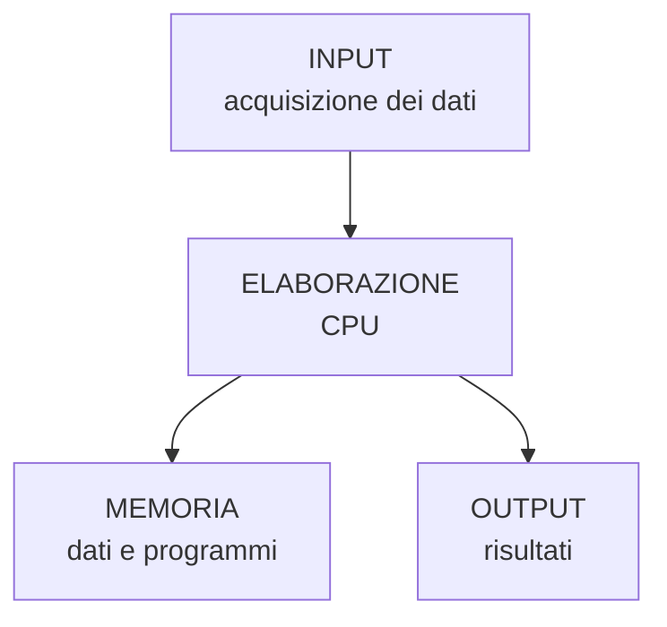

# 1. Il sistema di elaborazione

Un **sistema di elaborazione** è un insieme organizzato di componenti hardware e software che permette di:

- acquisire dati;
- memorizzare dati e istruzioni;
- elaborare i dati;
- produrre risultati;
- comunicare con dispositivi esterni.

Un computer può quindi essere visto come un sistema che realizza il ciclo:

## Componenti fondamentali

| Componente | Funzione principale |
|---|---|
| **CPU** | Esegue le istruzioni ed elabora i dati |
| **Memoria centrale** | Contiene temporaneamente programmi e dati in uso |
| **Memorie secondarie** | Conservano dati e programmi in modo persistente |
| **Bus** | Trasportano dati, indirizzi e segnali di controllo |
| **Periferiche di input** | Permettono di introdurre dati nel sistema |
| **Periferiche di output** | Presentano all'esterno i risultati |
| **Periferiche I/O** | Consentono sia input sia output |

---
