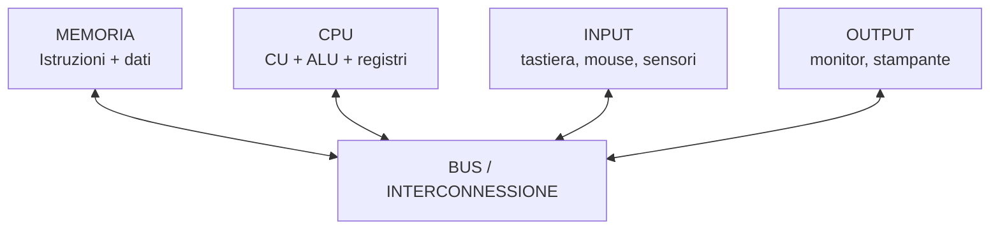
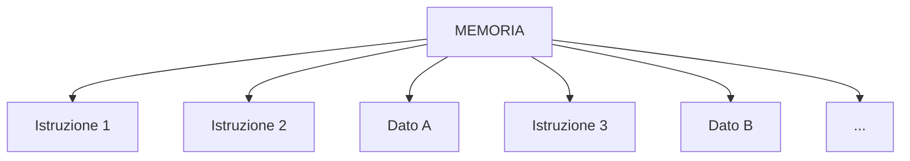
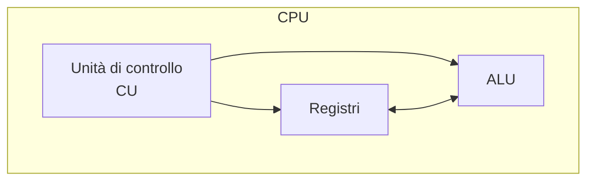
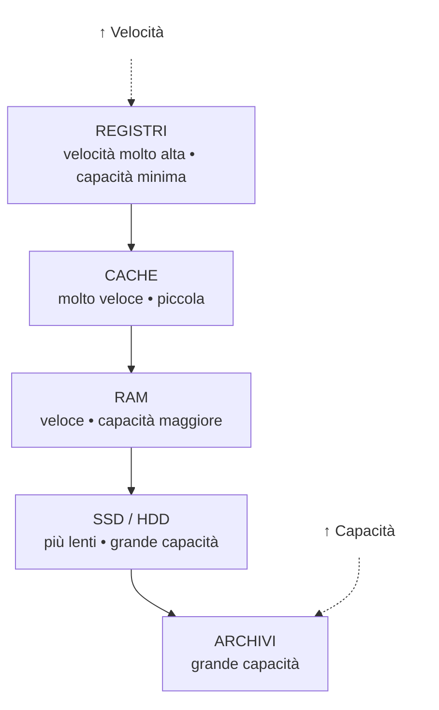
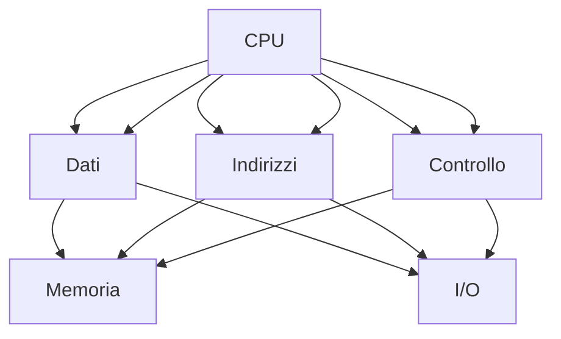

# 2. Il modello funzionale
## Approfondimento: dal modello teorico all'architettura reale

Il modello di Von Neumann è un **modello funzionale**, cioè descrive quali funzioni devono essere svolte dal sistema e come possono essere organizzate. Non deve essere interpretato come una fotografia precisa della scheda madre di un computer moderno.

Nei sistemi contemporanei la situazione è più articolata. La CPU può contenere controller della memoria, cache di più livelli, unità di esecuzione parallele e sistemi di interconnessione molto più sofisticati del semplice bus condiviso rappresentato nei diagrammi didattici. Anche le periferiche possono avere processori propri e trasferire dati senza coinvolgere continuamente la CPU.

Il modello rimane però fondamentale perché permette di rispondere a una domanda essenziale: **chi produce, conserva, trasferisce ed elabora l'informazione?**

### Dati e istruzioni

Una distinzione utile è quella tra **dato** e **istruzione**:

- un dato è un'informazione sulla quale il programma deve operare;
- un'istruzione specifica quale operazione deve essere compiuta;
- entrambe devono essere rappresentate in una forma codificata comprensibile dall'hardware.

Per esempio, un programma potrebbe richiedere:

```text
somma il valore contenuto in R1 con quello contenuto in R2
```

A livello macchina questa richiesta viene rappresentata mediante una specifica istruzione dell'ISA del processore.

### Il collo di bottiglia di Von Neumann

Il modello evidenzia anche un problema strutturale: istruzioni e dati devono essere trasferiti tra memoria e CPU. Se il processore aumenta la propria capacità di elaborazione più rapidamente della velocità con cui il sottosistema di memoria riesce a fornire informazioni, si crea un divario di prestazioni.

Le tecniche che incontreremo nel capitolo — **cache, pipeline, parallelismo e interconnessioni più veloci** — possono essere viste anche come risposte a questo problema.


## 2.1 Il modello di Von Neumann

Il modello di **Von Neumann** descrive una struttura fondamentale dei moderni sistemi di elaborazione.

L'idea centrale è la **memorizzazione comune di dati e istruzioni**:

> Il programma da eseguire e i dati su cui il programma opera vengono memorizzati nella stessa memoria.

Il modello comprende principalmente:

1. **CPU**
2. **memoria**
3. **unità di input**
4. **unità di output**
5. **sistema di collegamento**, storicamente rappresentato dai bus.

### Schema



### Il concetto di programma memorizzato

Prima dell'affermazione del modello di programma memorizzato, dati e istruzioni potevano essere gestiti in modo più separato.

Nel modello di Von Neumann:



La CPU legge dalla memoria sia le istruzioni sia i dati.

### Un limite del modello di Von Neumann

CPU e memoria comunicano attraverso un sistema condiviso di trasferimento delle informazioni.

Se la CPU è molto veloce ma la memoria non riesce a fornire dati e istruzioni alla stessa velocità, la CPU può rimanere in attesa.

Questo problema è spesso indicato come **collo di bottiglia di Von Neumann**.

---

## 2.2 La CPU

La **Central Processing Unit (CPU)** è l'unità che interpreta ed esegue le istruzioni dei programmi.

Le sue parti fondamentali sono:

| Componente | Funzione |
|---|---|
| **Unità di controllo (CU)** | Coordina l'esecuzione delle istruzioni |
| **ALU** | Esegue operazioni aritmetiche e logiche |
| **Registri** | Memorizzano temporaneamente dati, indirizzi e informazioni di controllo |
| **Clock** | Sincronizza le operazioni |
| **Cache** | Mantiene vicini alla CPU dati e istruzioni utilizzati frequentemente |

Schema semplificato:



---

## 2.3 La memoria

La memoria permette di conservare:

- istruzioni;
- dati;
- risultati intermedi.

Si distingue principalmente tra:

- **memoria centrale**, direttamente utilizzata durante l'elaborazione;
- **memoria secondaria**, destinata alla conservazione permanente.

### Gerarchia della memoria

In generale:



Avvicinandosi alla CPU:

- aumenta la velocità;
- diminuisce generalmente la capacità;
- aumenta il costo per bit.

---

## 2.4 Il sistema di input/output

Il sistema **I/O (Input/Output)** permette al computer di comunicare con l'esterno.

Esempi:

- tastiera → input;
- mouse → input;
- monitor → output;
- stampante → output;
- disco → input/output;
- scheda di rete → input/output.

Le periferiche non comunicano necessariamente direttamente con la CPU: spesso utilizzano **controller** e **interfacce** che gestiscono il trasferimento dei dati.

---

## 2.5 I bus

Un **bus** è un insieme di linee e segnali utilizzati per trasferire informazioni tra componenti del sistema.

Tradizionalmente si distinguono:

| Bus | Trasporta |
|---|---|
| **Bus dati** | Dati |
| **Bus indirizzi** | Indirizzi delle celle di memoria o delle risorse |
| **Bus di controllo** | Segnali di controllo e sincronizzazione |

Schema:



---
