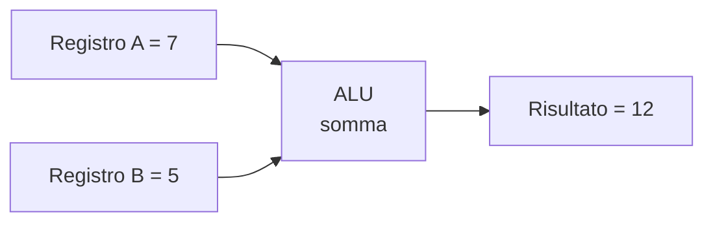

# 3. La CPU
## Approfondimento: come lavora realmente un processore

La CPU moderna non è semplicemente una ALU collegata a una memoria. È un sistema complesso nel quale diverse unità possono lavorare contemporaneamente.

Un processore può avere più **core**. Ogni core dispone di proprie risorse di esecuzione e può eseguire un flusso di istruzioni indipendente dagli altri core. Alcuni livelli di cache possono invece essere condivisi.

### Core e thread

È importante distinguere:

- **core**: unità fisica di elaborazione;
- **thread hardware**: flusso logico di esecuzione che può essere gestito dal core;
- **processo**: programma in esecuzione gestito dal sistema operativo;
- **thread software**: unità di esecuzione gestita dal programma/sistema operativo.

Avere più core non significa automaticamente ottenere un'accelerazione proporzionale: il programma deve poter sfruttare il parallelismo e il sistema operativo deve poter distribuire il lavoro.

### Frequenza, IPC e prestazioni

La frequenza indica quante oscillazioni del clock avvengono in un secondo, ma non dice quante istruzioni vengono completate a ogni ciclo.

Una semplificazione utile è:

\[
prestazioni \propto frequenza 	imes IPC
\]

dove **IPC** significa *Instructions Per Cycle*.

L'IPC effettivo dipende dall'architettura e dal programma. Cache miss, salti, dipendenze tra istruzioni e attese per la memoria possono ridurlo.

### Ampiezza del processore

Termini come **32 bit** e **64 bit** non indicano semplicemente la velocità del processore. Descrivono caratteristiche dell'architettura, tra cui la dimensione di registri e operandi e, in base all'ISA e all'implementazione, lo spazio di indirizzamento disponibile.

Per questo non è corretto dire:

> "un processore a 64 bit è il doppio più veloce di uno a 32 bit".

Il numero di bit riguarda principalmente il modello di elaborazione e di indirizzamento, non una misura diretta della velocità.


## 3.1 Architettura di un processore

Un processore moderno contiene molti componenti, ma per comprenderne il funzionamento possiamo partire da:

- **ALU (Arithmetic Logic Unit)**;
- **Control Unit (CU)**;
- **registri**;
- **clock**;
- **cache**;
- unità specializzate, ad esempio per operazioni vettoriali o in virgola mobile.

### ALU

L'ALU esegue operazioni come:

- somma;
- sottrazione;
- confronti;
- AND;
- OR;
- XOR;
- NOT;
- operazioni di shift.

Esempio:



---

## 3.2 L'unità di controllo

La **Control Unit** coordina l'attività della CPU.

In particolare:

1. recupera l'istruzione;
2. la interpreta;
3. determina quali operazioni devono essere eseguite;
4. coordina registri, ALU, memoria e altre unità.

Non "calcola" direttamente il risultato di una somma: stabilisce come devono collaborare i componenti che la eseguono.

---

## 3.3 Il clock

Il **clock** è un segnale periodico che sincronizza le operazioni del processore.

La frequenza viene misurata in **hertz (Hz)**.

| Frequenza | Significato |
|---:|---|
| 1 Hz | 1 ciclo al secondo |
| 1 MHz | 1 milione di cicli/s |
| 1 GHz | 1 miliardo di cicli/s |

Se un clock funziona a:

```text
3 GHz
```

significa che produce circa:

```text
3.000.000.000 cicli al secondo
```

### Attenzione

> Una CPU con frequenza maggiore non è necessariamente più veloce in ogni situazione.

Le prestazioni dipendono anche da:

- architettura;
- numero di core;
- IPC (Instructions Per Cycle);
- cache;
- pipeline;
- memoria;
- tipo di programma;
- parallelismo.

---

## 3.4 I registri

I **registri** sono piccole memorie estremamente veloci integrate nella CPU.

Contengono informazioni necessarie all'esecuzione delle istruzioni.

### Alcuni registri importanti

| Registro | Funzione |
|---|---|
| **PC / Program Counter** | Contiene l'indirizzo della prossima istruzione |
| **IR / Instruction Register** | Contiene l'istruzione corrente |
| **MAR** | Contiene l'indirizzo della memoria da utilizzare |
| **MDR/MBR** | Contiene il dato trasferito da/verso la memoria |
| **Accumulator** | Utilizzato in alcune architetture per risultati intermedi |
| **Registri generali** | Contengono dati e risultati temporanei |
| **PSW / Flags** | Contengono informazioni sullo stato del processore |

I nomi e l'organizzazione possono variare a seconda dell'architettura.

---

## 3.5 Velocità di elaborazione

Non esiste una singola misura sufficiente per descrivere le prestazioni di una CPU.

| Parametro | Che cosa indica |
|---|---|
| Frequenza | Cicli di clock al secondo |
| IPC | Istruzioni completate mediamente per ciclo |
| Numero di core | Numero di unità di elaborazione indipendenti |
| Cache | Capacità di conservare dati vicini al processore |
| Ampiezza registri | Dimensione dei dati elaborabili direttamente |
| Pipeline | Possibilità di sovrapporre fasi di istruzioni |
| Bus/interconnessioni | Velocità di trasferimento dei dati |

Una relazione semplificata può essere:

```text
prestazioni teoriche ≈ frequenza × IPC
```

ma nella pratica il risultato dipende anche da memoria, cache, branch, I/O e dal programma eseguito.

---
