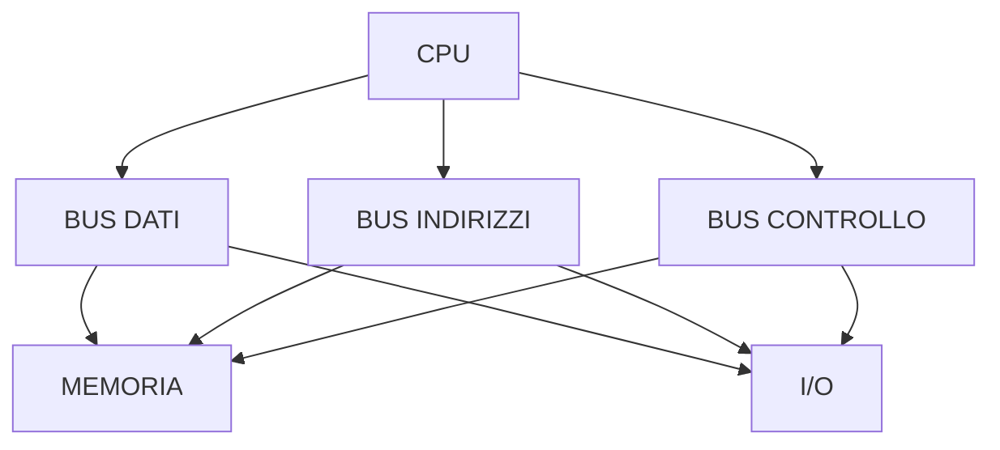

# 4. I bus
## Approfondimento: banda e latenza

Quando si parla di prestazioni di un collegamento bisogna distinguere almeno due concetti:

- **banda**: quantità di dati trasferibile per unità di tempo;
- **latenza**: tempo necessario prima che un'operazione produca o inizi a produrre il risultato.

Un collegamento può avere una banda elevata ma una latenza non trascurabile. Per questo "più GB/s" e "risposta più rapida" non sono sempre sinonimi.

### Trasferimento sincrono e asincrono

In un sistema sincrono le operazioni sono coordinate da un riferimento temporale comune. In un sistema asincrono la comunicazione utilizza meccanismi diversi per coordinare mittente e destinatario.

I protocolli moderni introducono inoltre:

- pacchetti;
- controllo degli errori;
- code;
- arbitraggio;
- meccanismi di flow control;
- collegamenti punto-punto.

Quindi il semplice modello di "fili paralleli" è utile per introdurre il concetto, ma non descrive da solo le interconnessioni moderne.

### Perché il bus può diventare un collo di bottiglia?

Se più componenti richiedono contemporaneamente l'accesso a una risorsa condivisa, le richieste devono essere coordinate. Questo introduce attese.

Per migliorare le prestazioni si possono utilizzare:

- maggiore frequenza;
- maggiore ampiezza;
- più trasferimenti per ciclo;
- cache;
- collegamenti dedicati;
- parallelismo;
- trasferimenti DMA per alcune periferiche.

Il **DMA (Direct Memory Access)** permette a una periferica di trasferire dati verso o dalla memoria senza richiedere alla CPU di gestire ogni singolo byte trasferito. La CPU configura l'operazione e viene normalmente informata al termine o in presenza di condizioni specifiche.


## 4.1 Organizzazione dei bus

Un sistema di elaborazione deve trasferire continuamente:

- dati;
- indirizzi;
- comandi;
- segnali di sincronizzazione.

Tradizionalmente il bus di sistema viene rappresentato come:



Nei sistemi moderni l'organizzazione fisica è molto più complessa: molte connessioni sono realizzate tramite interconnessioni punto-punto e controller integrati nel processore.

---

## 4.2 Bus dati

Il **bus dati** trasferisce i dati.

La sua ampiezza indica quanti bit possono essere trasferiti in parallelo in una determinata operazione.

Esempio:

```text
bus dati a 32 bit
↓
32 bit trasferibili in parallelo
```

Un bus più ampio può aumentare la quantità di dati trasferibile per operazione, ma le prestazioni dipendono anche dalla frequenza e dall'organizzazione del sistema.

---

## 4.3 Bus indirizzi

Il bus indirizzi identifica la posizione della risorsa da raggiungere.

Se un sistema utilizza `n` bit di indirizzo, il numero teorico di indirizzi distinti è:

\[
2^n
\]

Per esempio:

| Bus indirizzi | Indirizzi teorici |
|---:|---:|
| 8 bit | 256 |
| 16 bit | 65.536 |
| 20 bit | 1.048.576 |
| 32 bit | 4.294.967.296 |

Se ogni indirizzo identifica un byte, un bus indirizzi a 32 bit permette di indirizzare teoricamente fino a **4 GiB** di spazio di indirizzamento.

> Il limite effettivo della memoria utilizzabile può essere diverso per ragioni architetturali e software.

---

## 4.4 Bus di controllo

Trasporta segnali utilizzati per coordinare le operazioni.

Esempi:

- lettura;
- scrittura;
- interrupt;
- clock;
- reset;
- segnali di sincronizzazione.

---

## 4.5 Ottimizzazione delle prestazioni del bus

Le prestazioni di un collegamento dipendono, tra gli altri fattori, da:

- frequenza;
- ampiezza;
- numero di trasferimenti per ciclo;
- protocollo;
- latenza;
- parallelismo;
- modalità di arbitraggio.

Una grandezza utile è la **larghezza di banda**.

In forma semplificata:

\[
B \approx \frac{ampiezza\ del\ bus \times trasferimenti/s}{8}
\]

Esempio teorico:

```text
bus = 64 bit
trasferimenti = 100 milioni/s

64 × 100.000.000 = 6,4 Gbit/s

6,4 / 8 = 0,8 GB/s
```

La banda reale può essere inferiore a quella teorica a causa dell'overhead del protocollo e dei tempi di attesa.

---
