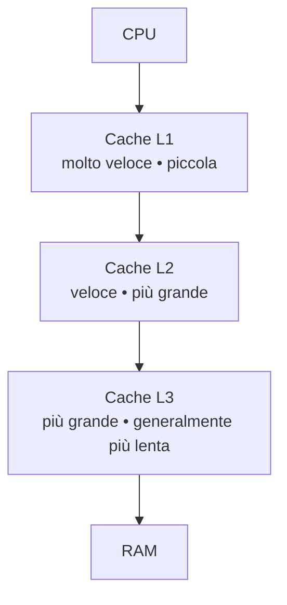
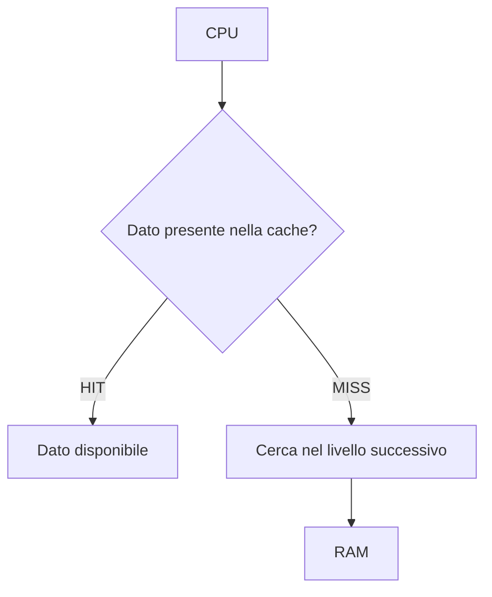

# 5. La memoria cache
## Approfondimento: perché la cache funziona

La cache funziona perché i programmi reali non accedono alla memoria in modo completamente casuale.

La **località temporale** significa che un'informazione utilizzata recentemente ha una buona probabilità di essere riutilizzata.

La **località spaziale** significa che, quando un programma accede a un indirizzo, è probabile che utilizzi anche indirizzi vicini.

Un esempio tipico è un ciclo che percorre un array:

```text
A[0]
A[1]
A[2]
A[3]
A[4]
...
```

Gli elementi dell'array sono memorizzati in posizioni vicine. La cache può quindi trasferire un intero blocco, detto **cache line**, invece del solo dato richiesto.

### Hit rate e miss rate

Il rapporto tra accessi soddisfatti dalla cache e accessi complessivi è il **hit rate**:

\[
hit\ rate = rac{cache\ hit}{accessi\ totali}
\]

Il **miss rate** è:

\[
miss\ rate = 1 - hit\ rate
\]

Anche un piccolo aumento del miss rate può avere un impatto significativo quando la differenza di latenza tra cache e memoria principale è grande.

### Cache e multicore

Con più core possono esistere cache private e cache condivise. Se due core possiedono copie dello stesso dato, il sistema deve mantenere una forma di **coerenza della cache**.

Questo introduce protocolli e meccanismi hardware specifici. L'obiettivo è fare in modo che i core non lavorino indefinitamente su copie incoerenti dello stesso dato.


## 5.1 Perché serve la cache?

La CPU può elaborare dati molto più velocemente rispetto alla memoria principale.

La **cache** riduce il tempo medio necessario per ottenere dati e istruzioni utilizzati frequentemente.



---

## 5.2 Funzioni della cache

La cache sfrutta principalmente due proprietà:

### Località temporale

Se un dato è stato utilizzato recentemente, è probabile che venga utilizzato nuovamente.

Esempio:

```text
x = x + 1
x = x * 2
x = x - 3
```

La variabile `x` viene utilizzata ripetutamente.

### Località spaziale

Se viene utilizzato un indirizzo di memoria, è probabile che vengano utilizzati anche indirizzi vicini.

Questo è particolarmente importante nell'esecuzione sequenziale delle istruzioni.

---

## 5.3 Cache hit e cache miss

Quando la CPU cerca un dato:

- **cache hit** → il dato è presente nella cache;
- **cache miss** → il dato non è presente e deve essere recuperato da un livello più lento.



---

## 5.4 Gestione della cache

La cache deve stabilire:

- quali dati conservare;
- dove conservarli;
- quando sostituirli;
- come mantenere coerenti eventuali copie.

Nei processori moderni esistono spesso più livelli:

| Livello | Caratteristiche generali |
|---|---|
| **L1** | Molto veloce, capacità ridotta, spesso separata per dati/istruzioni |
| **L2** | Più grande, leggermente più lenta |
| **L3** | Ancora più grande, spesso condivisa tra più core |

Le dimensioni e l'organizzazione dipendono dal processore.

---
