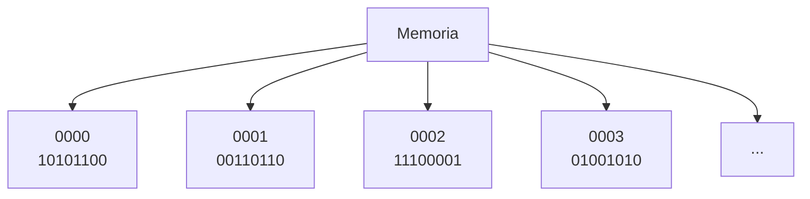
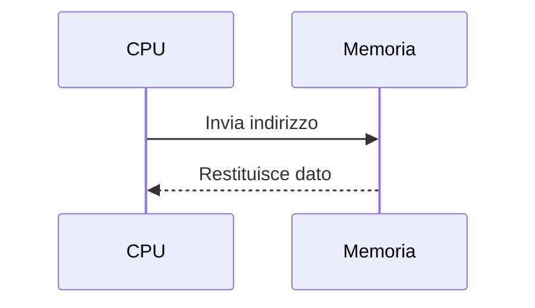

# 6. La memoria centrale
## Approfondimento: indirizzi e celle di memoria

La memoria centrale può essere vista come un enorme insieme di posizioni numerate. Il processore utilizza un indirizzo per identificare la posizione da cui leggere o nella quale scrivere.

È importante distinguere:

- **indirizzo** → identifica una posizione;
- **contenuto** → valore memorizzato nella posizione;
- **dimensione del dato** → numero di byte coinvolti nell'operazione.

### RAM dinamica

La DRAM memorizza l'informazione utilizzando celle che richiedono un meccanismo di mantenimento periodico. Questo spiega, a livello concettuale, perché la DRAM è diversa dalla SRAM utilizzata nelle cache.

La SRAM è più veloce ma richiede più transistor per cella ed è quindi meno densa e più costosa.

### Tempo di accesso e ciclo di memoria

Quando si valuta una memoria non bisogna considerare soltanto la capacità. Sono importanti anche:

- latenza;
- banda;
- frequenza;
- organizzazione dei canali;
- numero di trasferimenti per ciclo.

La memoria principale moderna è inoltre organizzata in **canali**, banchi e altre strutture interne che permettono di aumentare il parallelismo dei trasferimenti.

## 6.1 Caratteristiche

La memoria centrale è principalmente costituita dalla **RAM**.

Le sue caratteristiche principali sono:

- accesso relativamente rapido;
- accesso diretto alle celle;
- volatilità della RAM tradizionale;
- capacità misurata in byte e multipli;
- collegamento diretto con il sottosistema di memoria.

### Unità di misura

| Unità | Valore |
|---|---:|
| 1 byte | 8 bit |
| 1 KiB | 1024 byte |
| 1 MiB | 1024 KiB |
| 1 GiB | 1024 MiB |
| 1 TiB | 1024 GiB |

> Nei dispositivi commerciali i produttori possono usare anche multipli decimali: 1 GB = 1.000.000.000 byte.

---

## 6.2 Organizzazione della memoria

La memoria può essere vista come un insieme di celle indirizzabili.

Ogni cella è identificata da un **indirizzo**.

La CPU utilizza l'indirizzo per specificare quale informazione leggere o modificare.

---

## 6.3 Operazioni sulla memoria

Le operazioni fondamentali sono:

### Lettura

### Scrittura

---

## 6.4 Tipologie di memoria

### RAM

La RAM è una memoria:

- ad accesso casuale/diretto;
- volatile;
- riscrivibile.

Le principali famiglie storiche sono:

| Tipo | Caratteristica |
|---|---|
| **SRAM** | Molto veloce, costosa, usata soprattutto per cache |
| **DRAM** | Più densa ed economica, utilizzata per la memoria principale |

Le RAM moderne utilizzano varianti della famiglia **DDR SDRAM**.

---

## 6.5 ROM e memorie non volatili

Il termine ROM indica una famiglia di memorie non volatili.

| Tipo | Caratteristica |
|---|---|
| ROM | Scritta in fase di produzione |
| PROM | Programmabile una sola volta |
| EPROM | Cancellabile e riprogrammabile, storicamente tramite UV |
| EEPROM | Cancellabile e riprogrammabile elettricamente |
| Flash | Evoluzione della memoria non volatile elettricamente riscrivibile |

Le memorie flash sono oggi utilizzate in SSD, chiavette USB, schede di memoria e firmware.

---
