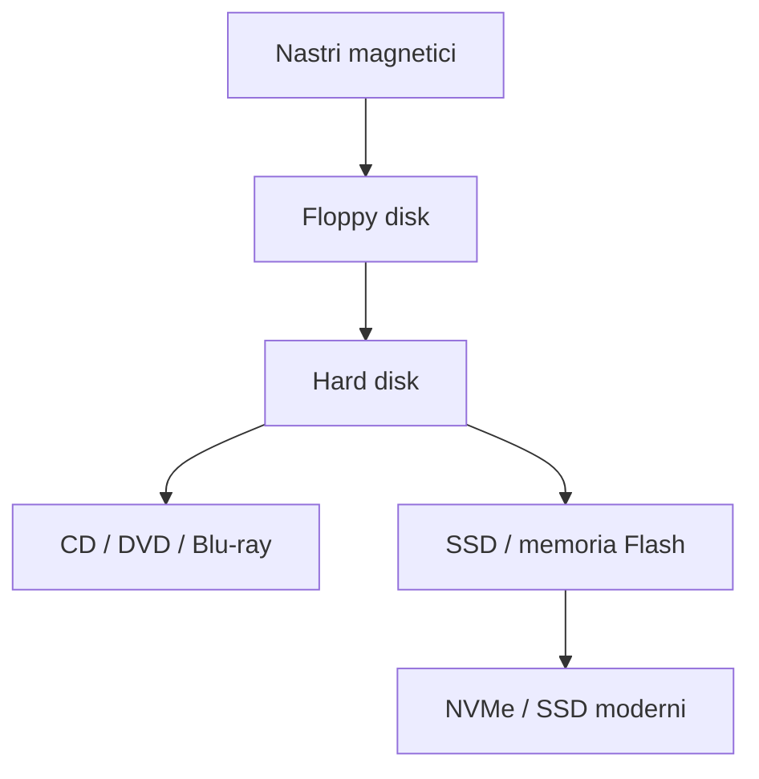
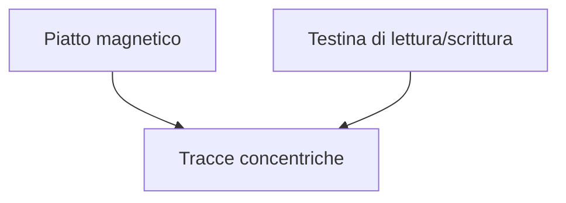
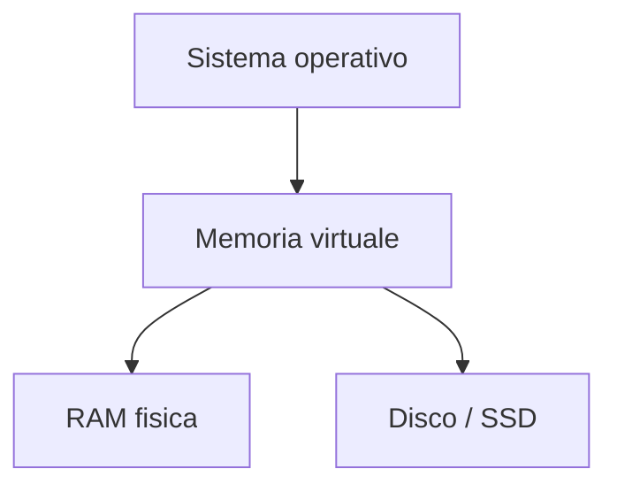

# 7. Le memorie secondarie
## Approfondimento: perché esistono più tecnologie di storage

Nessuna tecnologia di memoria secondaria è ottimale per tutti gli utilizzi.

Un archivio può privilegiare:

- costo per terabyte;
- velocità;
- affidabilità;
- consumo energetico;
- resistenza agli urti;
- durata nel tempo;
- facilità di sostituzione.

### HDD e SSD

L'HDD utilizza la rotazione di piatti magnetici e il movimento di una testina. La latenza è quindi influenzata anche da fenomeni meccanici.

L'SSD utilizza invece memoria flash. L'assenza di parti mobili permette tempi di accesso molto inferiori.

Tuttavia "SSD = indistruttibile" è una conclusione errata: anche un SSD può guastarsi e i dati importanti devono essere sottoposti a backup.

### RAID e backup

RAID e backup risolvono problemi differenti.

**RAID** lavora sulla disponibilità e/o sulle prestazioni di un insieme di dischi.

**Backup** significa avere una copia separata dei dati, possibilmente su un sistema indipendente.

Un RAID può quindi continuare a funzionare dopo il guasto di un disco, ma non protegge necessariamente da:

- cancellazione accidentale;
- ransomware;
- corruzione logica;
- errore umano;
- incendio o furto dell'intero sistema.

### Memoria virtuale e isolamento

La memoria virtuale ha anche un'importante funzione di **isolamento**: ogni processo può vedere uno spazio di indirizzamento virtuale proprio, mentre il sistema operativo e l'hardware di gestione della memoria traducono gli indirizzi virtuali in indirizzi fisici.

Questo meccanismo è fondamentale per sicurezza, stabilità e multitasking.


Le memorie secondarie consentono di conservare dati anche quando il computer viene spento.

| Caratteristica | Memoria centrale | Memoria secondaria |
|---|---|---|
| Volatilità | Generalmente sì | Generalmente no |
| Velocità | Maggiore | Minore |
| Capacità | Inferiore | Maggiore |
| Costo/GB | Maggiore | Inferiore |
| Utilizzo | Programmi e dati in esecuzione | Conservazione permanente |

---

## 7.1 Evoluzione delle memorie secondarie

Una possibile linea evolutiva è:



---

## 7.2 Memorie magnetiche

### Hard Disk Drive — HDD

Un HDD utilizza:

- piatti magnetici;
- testine di lettura/scrittura;
- motore;
- elettronica di controllo.

Schema concettuale:



### Vantaggi

- grande capacità;
- costo per GB contenuto;
- adatti all'archiviazione.

### Svantaggi

- parti meccaniche;
- maggiore latenza;
- più sensibili agli urti rispetto agli SSD.

---

## 7.3 Memorie Flash

La memoria flash è **non volatile** e non utilizza parti meccaniche in movimento.

È presente in:

- SSD;
- chiavette USB;
- schede SD;
- smartphone;
- dispositivi embedded.

### Vantaggi rispetto agli HDD

| Flash/SSD | HDD |
|---|---|
| Nessuna parte meccanica | Parti meccaniche |
| Latenza molto bassa | Latenza maggiore |
| Silenziosa | Può produrre rumore |
| Maggiore resistenza agli urti | Più sensibile agli urti |
| Consumi generalmente inferiori | Maggiori consumi in molte condizioni |

### Limite importante

Le celle flash hanno un numero finito di cicli di programmazione/cancellazione.

I controller degli SSD utilizzano tecniche come:

- wear leveling;
- gestione dei blocchi;
- garbage collection;
- over-provisioning;
- correzione degli errori.

---

## 7.4 Memorie ottiche

Utilizzano un laser per leggere e, in alcuni casi, scrivere informazioni.

| Supporto | Capacità tipica |
|---|---:|
| CD | circa 700 MB |
| DVD | circa 4,7 GB per strato |
| Blu-ray | circa 25 GB per strato |

Oggi hanno un ruolo molto meno centrale rispetto al passato.

---

# 7.5 RAID

**RAID (Redundant Array of Independent Disks)** indica una tecnica per organizzare più unità di memoria in modo coordinato.

Gli obiettivi possono essere:

- aumentare le prestazioni;
- aumentare l'affidabilità;
- garantire ridondanza;
- combinare più obiettivi.

> RAID non sostituisce un backup.

### RAID 0

I dati vengono distribuiti tra più dischi.

```text
Dato: A B C D E F

Disco 1: A   C   E
Disco 2: B   D   F
```

**Vantaggio:** prestazioni.

**Svantaggio:** nessuna ridondanza; se si rompe un disco, si può perdere l'intero insieme di dati.

### RAID 1

Mirroring:

```text
Disco 1: A B C D
Disco 2: A B C D
```

**Vantaggio:** ridondanza.

**Svantaggio:** capacità utile circa pari a quella di un solo disco.

### RAID 5

Utilizza distribuzione dei dati e parità.

Con almeno 3 dischi può tollerare il guasto di un disco.

### RAID 6

Utilizza doppia parità e può tollerare il guasto di due dischi.

### Tabella RAID

| Livello | Tecnica | Min. dischi | Ridondanza | Obiettivo |
|---|---|---:|---|---|
| RAID 0 | Striping | 2 | No | Prestazioni |
| RAID 1 | Mirroring | 2 | Sì | Affidabilità |
| RAID 5 | Striping + parità | 3 | Sì | Equilibrio |
| RAID 6 | Striping + doppia parità | 4 | Sì | Maggiore tolleranza |
| RAID 10 | Mirroring + striping | 4 | Sì | Prestazioni + ridondanza |

---

# 7.6 Memoria virtuale

La **memoria virtuale** permette a un sistema operativo di utilizzare parte dello spazio di una memoria secondaria come supporto per estendere lo spazio di memoria apparentemente disponibile ai processi.

Nei sistemi moderni è tipicamente basata su **pagine**.



Quando una pagina richiesta non è presente in RAM si può verificare un **page fault**.

Il sistema operativo recupera quindi la pagina dalla memoria secondaria.

> La memoria virtuale è molto più lenta della RAM. Non deve essere confusa con un semplice "aumento della RAM".

---

# 7.7 Memorie a confronto

| Tecnologia | Volatile | Parti meccaniche | Velocità | Capacità | Utilizzo tipico |
|---|---|---|---|---|---|
| Registri | Sì | No | ★★★★★ | Minima | CPU |
| Cache | Sì | No | ★★★★★ | Molto piccola | CPU |
| RAM | Sì | No | ★★★★ | Media/alta | Programmi in esecuzione |
| SSD NVMe | No | No | ★★★ | Alta | Archiviazione |
| SSD SATA | No | No | ★★ | Alta | Archiviazione |
| HDD | No | Sì | ★ | Molto alta | Archiviazione |
| Ottico | No | No | ★ | Media | Distribuzione/archivio |

---
