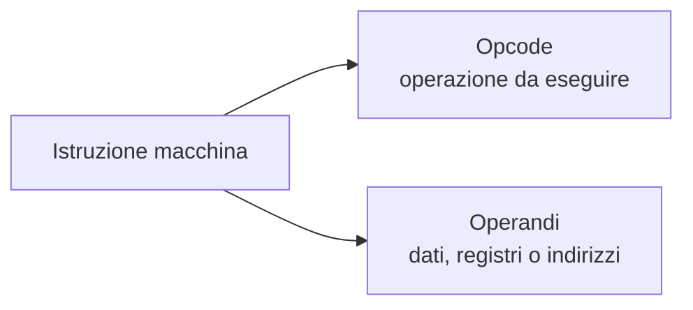
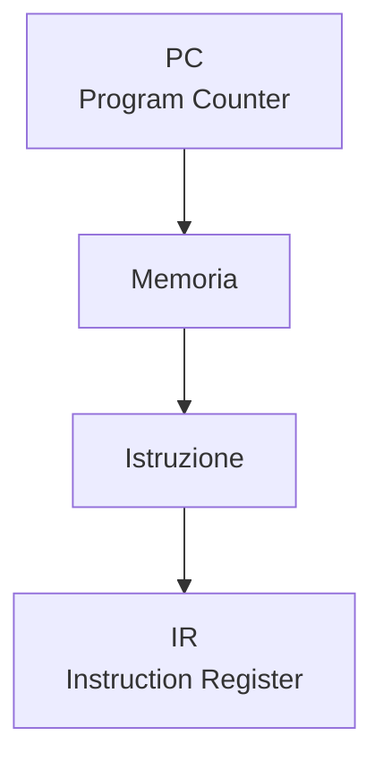
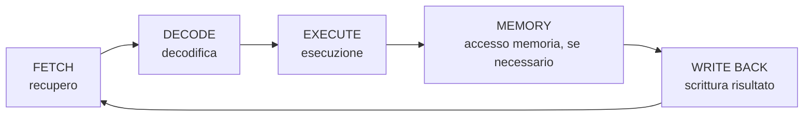

# 10. Il ciclo di esecuzione della CPU
## Approfondimento: istruzioni, registri e controllo del flusso

Il ciclo macchina è un modello concettuale. Una CPU reale può suddividere le operazioni in un numero diverso di stadi.

Consideriamo una semplice istruzione:

```text
ADD R1, R2, R3
```

Possiamo interpretarla concettualmente come:

> calcola R2 + R3 e memorizza il risultato in R1.

La CPU deve quindi:

1. trovare l'istruzione;
2. capire quale operazione rappresenta;
3. leggere gli operandi;
4. eseguire il calcolo;
5. memorizzare il risultato.

### Salti e Program Counter

Il PC normalmente avanza verso la prossima istruzione, ma non sempre.

Con un'istruzione di salto:

```text
if condizione vera:
    PC ← indirizzo destinazione
```

il normale flusso sequenziale viene modificato.

Questo è il motivo per cui le istruzioni di salto hanno un ruolo importante nella gestione della pipeline.


## 10.1 Il linguaggio macchina

La CPU non esegue direttamente programmi scritti in linguaggi come:

- C;
- Java;
- Python;
- PHP.

Questi linguaggi devono essere tradotti o interpretati secondo il relativo modello di esecuzione.

A livello hardware la CPU esegue **istruzioni macchina**, codificate in forma binaria.

Un'istruzione può essere concettualmente rappresentata come:



### Opcode

Indica l'operazione da eseguire.

Esempi concettuali:

```text
ADD
LOAD
STORE
JUMP
CMP
```

### Operandi

Indicano i dati, i registri o gli indirizzi coinvolti nell'operazione.

---

## 10.2 Esecuzione dei programmi

Un programma compilato contiene una sequenza di istruzioni macchina.

La CPU esegue ripetutamente un ciclo:

```text
FETCH → DECODE → EXECUTE → MEMORY → WRITE BACK
```

Non tutte le istruzioni utilizzano necessariamente tutte le fasi nello stesso modo.

---

# 10.3 Le fasi del ciclo macchina

## 1. Fetch

La CPU recupera dalla memoria l'istruzione indicata dal **Program Counter (PC)**.



Il PC viene aggiornato per puntare alla prossima istruzione, salvo modifiche dovute a salti o altre istruzioni di controllo.

---

## 2. Decode

L'unità di controllo interpreta l'istruzione.

Vengono identificati:

- tipo di operazione;
- registri coinvolti;
- operandi;
- modalità di indirizzamento.

---

## 3. Execute

La CPU esegue l'operazione.

Esempi:

- somma;
- confronto;
- salto;
- calcolo di un indirizzo;
- operazione logica.

---

## 4. Memory

Se necessario, viene effettuato un accesso alla memoria.

Esempi:

```text
LOAD  → lettura
STORE → scrittura
```

---

## 5. Write Back

Il risultato viene scritto nella destinazione prevista, spesso un registro.

---

## Schema completo



---
