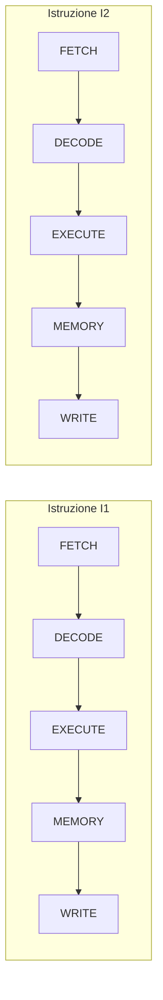

# 11. Il pipelining
## Approfondimento: throughput e latenza

La pipeline va compresa distinguendo **latenza** e **throughput**.

La latenza è il tempo necessario affinché una singola istruzione attraversi tutti gli stadi.

Il throughput indica invece quante istruzioni possono essere completate in un intervallo di tempo.

In una pipeline ideale a 5 stadi, dopo il riempimento della pipeline può essere completata circa un'istruzione per ciclo, anche se ogni singola istruzione richiede più stadi.

### Stalli

Quando una dipendenza impedisce di proseguire, uno stadio può rimanere fermo.

Questa situazione è detta **stall**.

Gli stalli riducono il vantaggio teorico della pipeline.

### Branch prediction

Per ridurre gli effetti dei salti condizionali, i processori moderni possono tentare di prevedere quale sarà il percorso seguito.

Se la previsione è corretta, la pipeline continua a essere alimentata.

Se è errata, alcune istruzioni già caricate devono essere scartate e il processore deve riprendere dal punto corretto.

Questo comportamento viene spesso descritto come **pipeline flush**.


## 11.1 La pipeline

Senza pipeline, la CPU potrebbe completare una istruzione prima di iniziare la successiva.

Con il **pipelining**, le diverse fasi di più istruzioni vengono sovrapposte.

### Senza pipeline



### Con pipeline

```mermaid
gantt
    title Esempio di pipeline a 5 stadi
    dateFormat X
    axisFormat %s
    section I1
    FETCH :i1f, 0, 1
    DECODE :i1d, 1, 1
    EXECUTE :i1e, 2, 1
    MEMORY :i1m, 3, 1
    WRITE :i1w, 4, 1
    section I2
    FETCH :i2f, 1, 1
    DECODE :i2d, 2, 1
    EXECUTE :i2e, 3, 1
    MEMORY :i2m, 4, 1
    WRITE :i2w, 5, 1
    section I3
    FETCH :i3f, 2, 1
    DECODE :i3d, 3, 1
    EXECUTE :i3e, 4, 1
    MEMORY :i3m, 5, 1
    section I4
    FETCH :i4f, 3, 1
    DECODE :i4d, 4, 1
    EXECUTE :i4e, 5, 1
```



L'obiettivo è aumentare il **throughput**, cioè il numero di istruzioni completate nell'unità di tempo.

> La pipeline non rende necessariamente più veloce l'esecuzione della singola istruzione; permette soprattutto di completare più istruzioni in sovrapposizione.

---

## 11.2 Analogia della catena di montaggio

Immaginiamo una fabbrica con cinque operazioni:

```text
Taglio → Assemblaggio → Verniciatura → Controllo → Imballaggio
```

Senza pipeline:

```text
Prodotto A: [1][2][3][4][5]
Prodotto B:                 [1][2][3][4][5]
```

Con pipeline:

```text
Prodotto A: [1][2][3][4][5]
Prodotto B:    [1][2][3][4][5]
Prodotto C:       [1][2][3][4][5]
```

Le fasi lavorano contemporaneamente su prodotti diversi.

---

# 11.3 Problemi di gestione della pipeline

Le istruzioni non sono sempre indipendenti.

I principali problemi sono detti **hazard**.

## Data hazard

Un'istruzione dipende dal risultato di una precedente.

```text
I1: R1 = R2 + R3
I2: R4 = R1 + R5
```

I2 ha bisogno di `R1`, prodotto da I1.

### Soluzioni

- forwarding;
- stallo;
- riordinamento delle istruzioni.

---

## Control hazard

Si verifica con salti e istruzioni condizionali.

```text
if (condizione)
    salta a L1
```

La CPU potrebbe aver già caricato istruzioni che non dovranno essere eseguite.

Una soluzione comune è la **branch prediction**.

---

## Structural hazard

Si verifica quando due operazioni richiedono contemporaneamente una risorsa hardware che non può servire entrambe.

### Tabella

| Hazard | Causa | Possibili soluzioni |
|---|---|---|
| Data | Dipendenza tra dati | Forwarding, stalli |
| Control | Salti/branch | Branch prediction |
| Structural | Risorsa hardware condivisa | Risorse aggiuntive, stalli |

---
