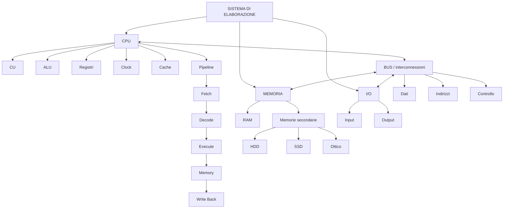

# 13. Mappa concettuale del capitolo

```mermaid
flowchart TB
    S["SISTEMA DI ELABORAZIONE"]
    S --> CPU["CPU"]
    S --> MEM["MEMORIA"]
    S --> IO["I/O"]
    CPU --> CU["CU"]
    CPU --> ALU["ALU"]
    CPU --> REG["Registri"]
    CPU --> CLK["Clock"]
    CPU --> CACHE["Cache"]
    CPU --> PIPE["Pipeline"]
    PIPE --> F["Fetch"]
    F --> D["Decode"]
    D --> E["Execute"]
    E --> M["Memory"]
    M --> W["Write Back"]
    MEM --> RAM["RAM"]
    MEM --> SEC["Memorie secondarie"]
    SEC --> HDD["HDD"]
    SEC --> SSD["SSD"]
    SEC --> OPT["Ottico"]
    IO --> IN["Input"]
    IO --> OUT["Output"]
    CPU <--> BUS["BUS / interconnessioni"]
    BUS <--> MEM
    BUS <--> IO
    BUS --> DATA["Dati"]
    BUS --> ADDR["Indirizzi"]
    BUS --> CTRL["Controllo"]
```

---
