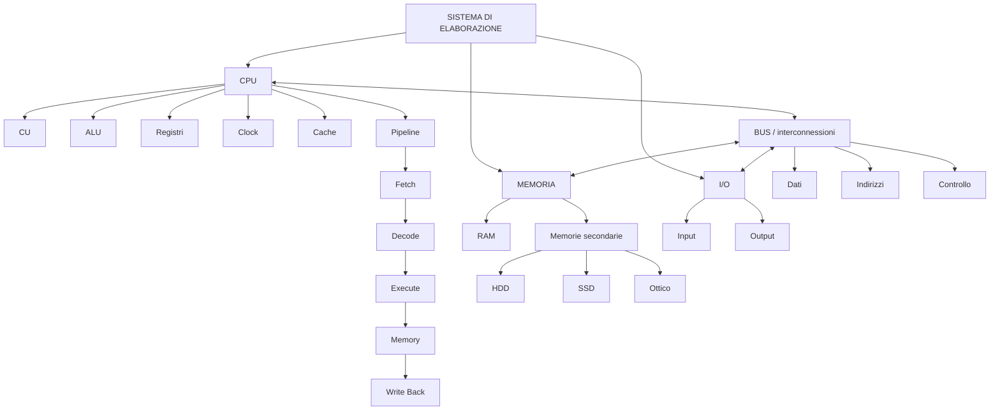

# Schema finale da ricordare

## Concetti chiave

> **1.** La CPU esegue istruzioni.

> **2.** La memoria centrale contiene temporaneamente programmi e dati necessari all'elaborazione.

> **3.** Le memorie secondarie conservano le informazioni in modo persistente.

> **4.** I bus e le interconnessioni permettono ai componenti di comunicare.

> **5.** La cache riduce il tempo medio di accesso alla memoria sfruttando la località temporale e spaziale.

> **6.** La pipeline permette di sovrapporre le fasi di più istruzioni.

> **7.** CISC e RISC rappresentano differenti approcci alla progettazione dell'Instruction Set Architecture.

---

## Collegamenti con i capitoli successivi

Questo capitolo costituisce la base per comprendere:

- **Sistemi operativi** → gestione di CPU, memoria, processi e periferiche;
- **Reti** → comunicazione tra dispositivi e interfacce di rete;
- **Sistemi embedded** → CPU, memoria e periferiche integrate;
- **Virtualizzazione** → utilizzo astratto delle risorse hardware;
- **Cybersecurity** → protezione di memoria, processore, periferiche e dati;
- **Prestazioni dei sistemi** → CPU, cache, memoria, I/O e colli di bottiglia.
