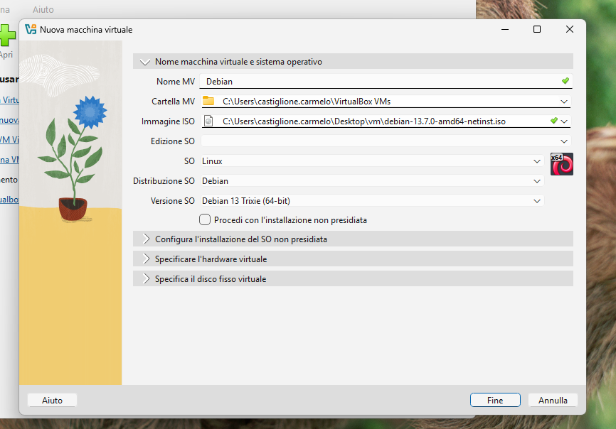
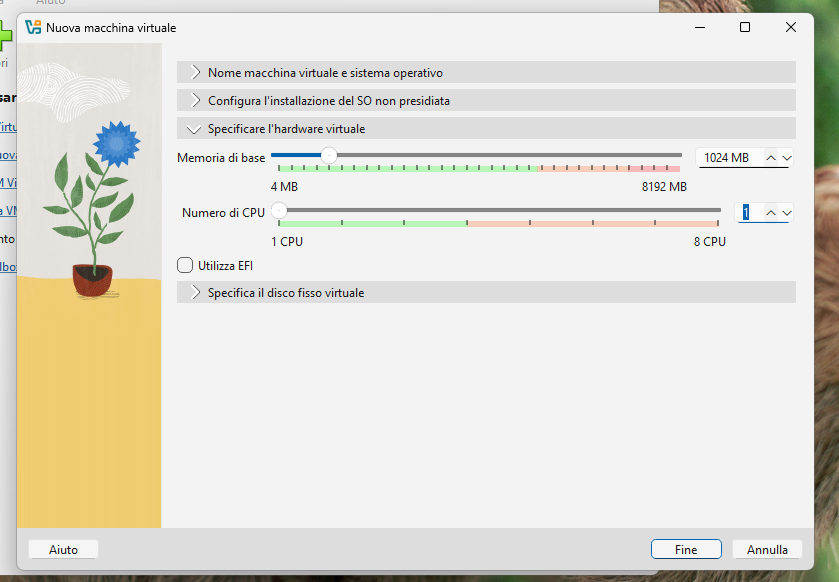
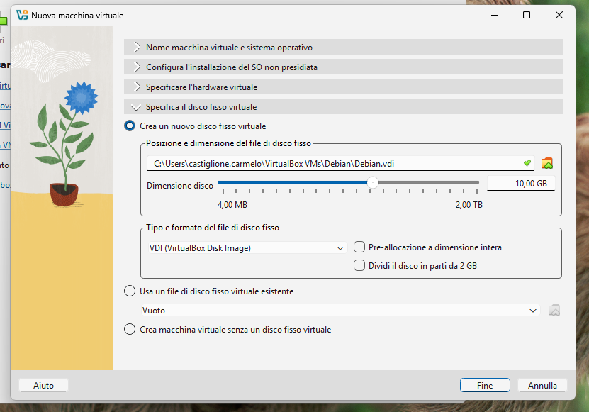

# 12.2 Lezione 2 --- Creazione della macchina virtuale

## Obiettivi

Lo studente deve imparare a:

-   creare una VM;
-   assegnare CPU e RAM;
-   creare un disco virtuale;
-   comprendere la differenza tra disco fisso e disco virtuale;
-   configurare una scheda di rete virtuale.

## Attività preliminare --- Scaricare Debian netinst

Aprire il [sito ufficiale di Debian per il download netinst](https://www.debian.org/CD/netinst/) e scaricare l'immagine **amd64** della versione stabile. Salvare il file ISO in una cartella facile da ritrovare: verrà selezionato durante la creazione della macchina virtuale.

L'immagine netinst contiene il programma di installazione e scarica dalla rete i componenti necessari per completare l'installazione di Debian. Durante l'installazione della VM sarà quindi necessaria una connessione a Internet.

## Attività 1 --- Creare la VM

## Configurazione proposta

``` text
Sistema operativo: Debian Linux
Architettura: 64 bit
CPU: 1 vCPU
RAM: 1 GB
Disco: 10 GB
Tipo disco: VDI
Allocazione: dinamica
Rete: NAT
Interfaccia grafica: no
```

## Attività 1 --- Creare la VM

In VirtualBox:

``` text
Nuova
```

Impostare:

``` text
Nome: Debian
Immagine SO: scegliere il percorso dell'immagine ISO di Debian
```



*La schermata iniziale permette di assegnare un nome alla macchina virtuale e di indicare l'immagine ISO e la versione del sistema operativo da installare. IMPORTANTE: togliere la spunta da "Procedi con l'installazione non presidiata".*

Assegnare:

``` text
RAM: 1024 MB
CPU: 1
```



*In questa schermata si scelgono le risorse hardware virtuali: nell'esempio vengono assegnati 1024 MB di RAM e 1 CPU.*

Creare un nuovo disco virtuale.

Impostare:

``` text
VDI
Allocazione dinamica
10 GB
```



*Qui si crea il disco virtuale in formato VDI e se ne imposta la dimensione massima a 10 GB. Lasciando disattivata la pre-allocazione, il file cresce man mano che la VM usa spazio.*

## Attività 2 --- Analizzare la configurazione

Prima di avviare la VM, aprire:

``` text
Impostazioni → Sistema
```

e osservare la quantità di RAM e CPU assegnate.

Poi:

``` text
Impostazioni → Archiviazione
```

e individuare il disco virtuale.

Infine:

``` text
Impostazioni → Rete
```

e osservare la scheda di rete virtuale.

### Domande

1.  Quanta RAM rimane al sistema host?
2.  Il disco virtuale occupa immediatamente 10 GB?
3.  Che cosa significa "allocazione dinamica"?
4.  La scheda di rete della VM è una scheda fisica?
5.  Quale dispositivo reale permette alla VM di comunicare con Internet?

------------------------------------------------------------------------
