# 12.3 Lezione 3 --- Installazione di Linux

## Obiettivi

Al termine dell'attività lo studente sarà in grado di:

- avviare l'installazione di Debian da un'immagine ISO;
- configurare lingua, rete e account;
- installare Debian sul disco virtuale;
- scegliere i componenti software essenziali;
- accedere al sistema e distinguere i privilegi di `root` da quelli di un utente normale.

## Prima di iniziare

Verificare che la macchina virtuale creata nella lezione precedente sia configurata per avviarsi dall'immagine ISO di Debian e disponga di una connessione di rete. Le schermate seguenti mostrano l'installazione grafica di Debian 13; alcune etichette possono variare leggermente in altre versioni.

## Attività 1 --- Avviare l'installazione

Avviare la macchina virtuale. Nel menu iniziale del programma di installazione scegliere **Graphical install** e premere `Invio`.

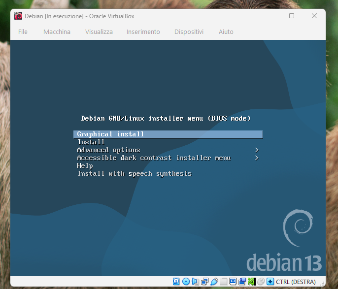

*Il menu permette di avviare l'installazione grafica, quella testuale o altre opzioni. La modalità grafica guida l'utente attraverso i passaggi con schermate e pulsanti.*

Selezionare la lingua che verrà usata durante l'installazione e, normalmente, anche come lingua predefinita del sistema.

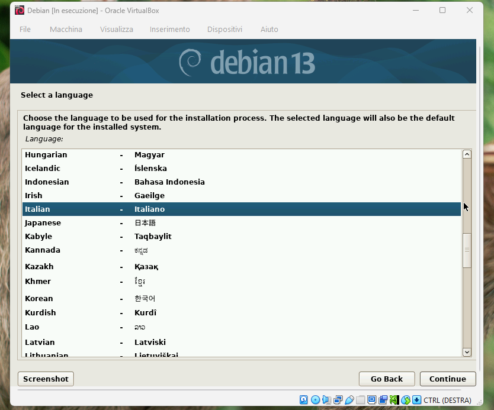

*Nell'elenco delle lingue è selezionato Italiano. La lingua scelta determina la lingua dell'installer e le impostazioni linguistiche iniziali del sistema installato.*

Scegliere il Paese o il territorio in cui si trova la macchina.

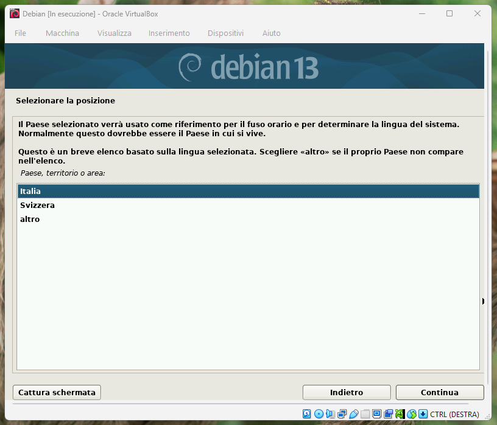

*Il Paese viene usato per impostare elementi locali, come fuso orario e mirror dei pacchetti. Selezionare Italia se ci si trova in Italia.*

Selezionare la disposizione della tastiera effettivamente collegata al computer host.

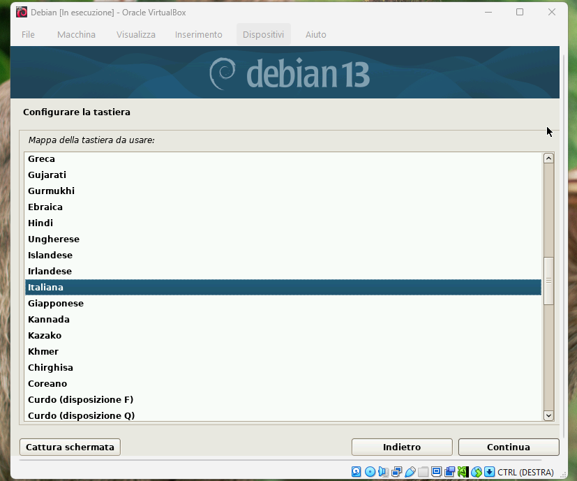

*La disposizione italiana fa corrispondere i tasti ai simboli stampati sulla tastiera. Una scelta errata può rendere difficile inserire password e comandi.*

## Attività 2 --- Configurare la rete e gli account

Assegnare alla macchina un nome host semplice, per esempio `debian`.

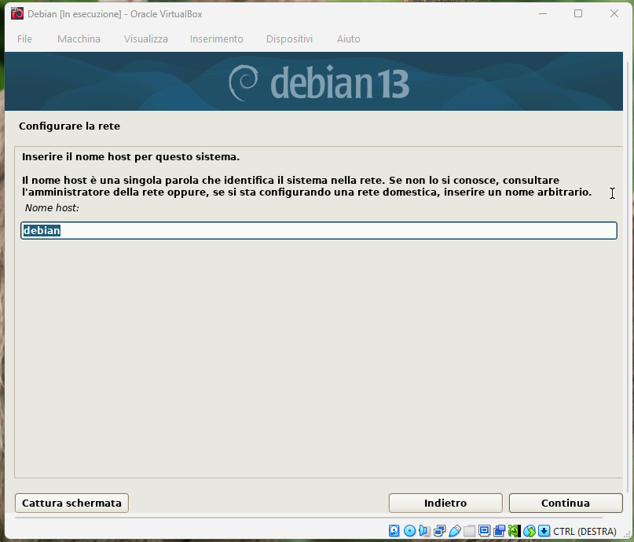

*Il nome host identifica la macchina nella rete locale. Usare una sola parola, senza spazi; nell'esempio viene usato `debian`.*

Se la macchina non appartiene a un dominio, lasciare vuoto il campo del dominio e proseguire.

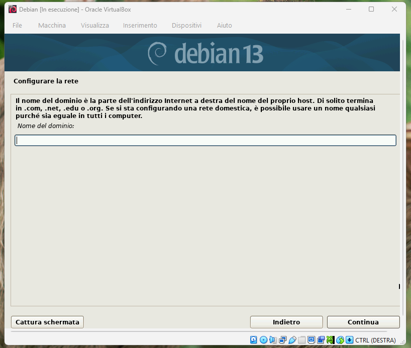

*Il dominio è necessario soprattutto nelle reti che usano nomi DNS interni. Per una VM di laboratorio isolata o collegata con NAT, in genere non occorre specificarlo.*

L'installer consente due modalità alternative per l'amministrazione. Nella prima si imposta una password per l'account `root` e la si conferma. In alternativa è possibile lasciare vuoti entrambi i campi della password di `root` e continuare. In questo caso verrà creato un utente normale con privilegi di amministrazione tramite `sudo`. Le due opzioni sono equivalenti dal punto di vista della sicurezza, ma la seconda è più comoda per un laboratorio.

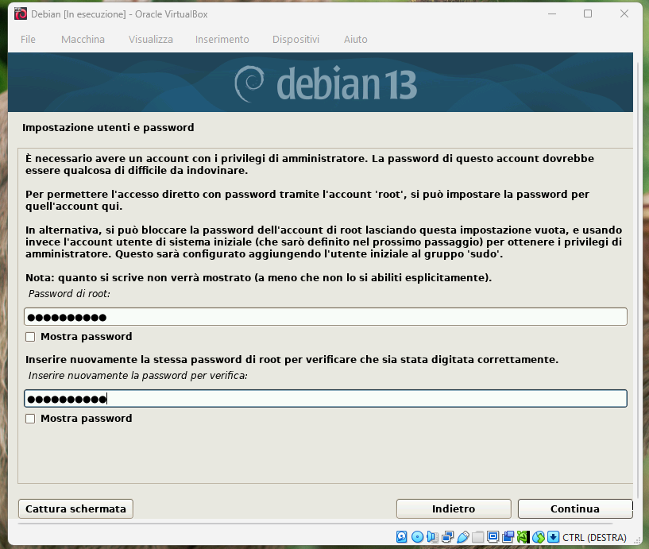

*Questa schermata imposta la password dell'amministratore `root`. La password non è visibile mentre viene digitata: sceglierne una robusta e conservarla in modo sicuro.*

In alternativa, lasciare vuoti entrambi i campi della password di `root` e continuare.

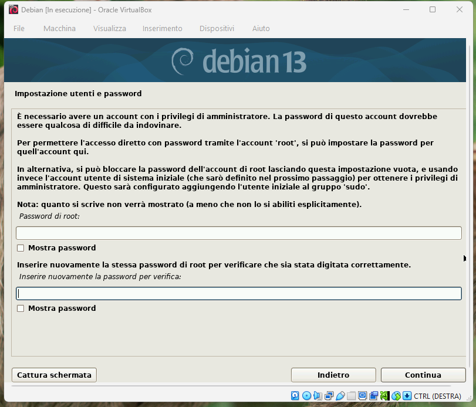

*Lasciando vuota la password di `root`, Debian disabilita l'accesso diretto a quell'account e configura l'utente normale creato nel passaggio successivo per l'amministrazione tramite `sudo`.*

Inserire il nome completo della persona che userà l'account.

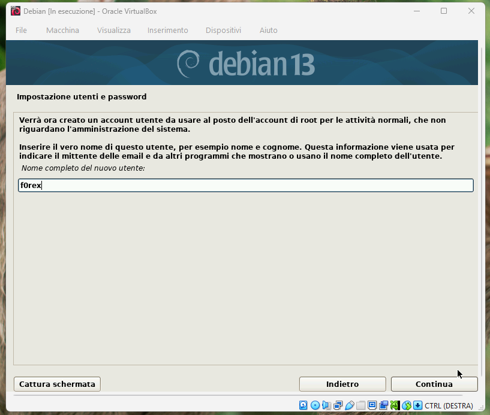

*Il nome completo è un'informazione descrittiva associata all'account; non è il nome da digitare per accedere al sistema.*

Scegliere il nome breve dell'utente, che verrà richiesto al login.

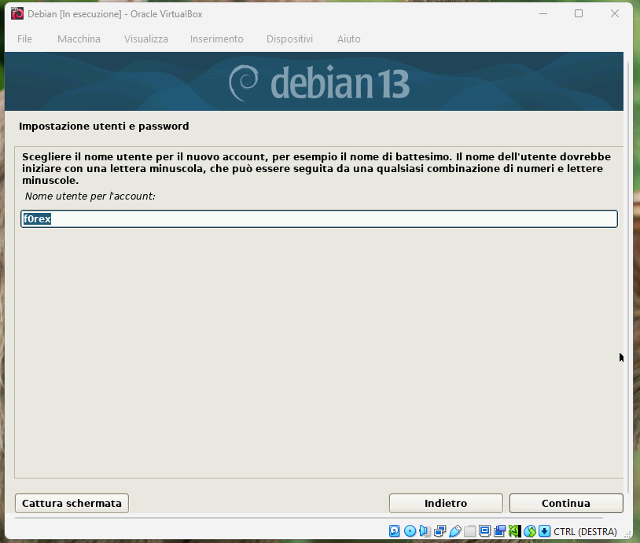

*Il nome utente identifica l'account nei comandi e nella schermata di accesso. È consigliabile usare lettere minuscole e non inserire spazi.*

Impostare e confermare la password dell'utente normale.

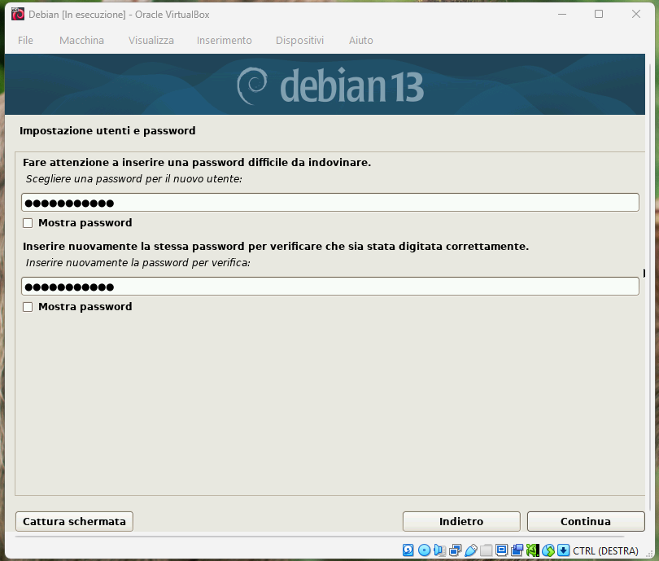

*Questa password serve per accedere con l'account normale. Se si userà `sudo`, verrà richiesta anche per confermare i comandi amministrativi.*

## Attività 3 --- Partizionare il disco virtuale

Per un laboratorio iniziale scegliere il partizionamento guidato sull'intero disco.

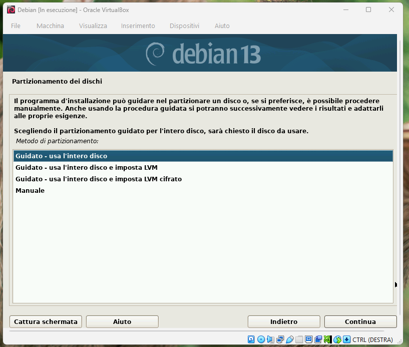

*Il partizionamento guidato crea automaticamente le partizioni necessarie. Le opzioni con LVM aggiungono una gestione più flessibile dei volumi, mentre l'opzione manuale è destinata a configurazioni personalizzate.*

Selezionare il disco della macchina virtuale, riconoscibile dal nome e dalla capacità. Nell'esempio è il disco VirtualBox `/dev/sda` da circa 10,7 GB.

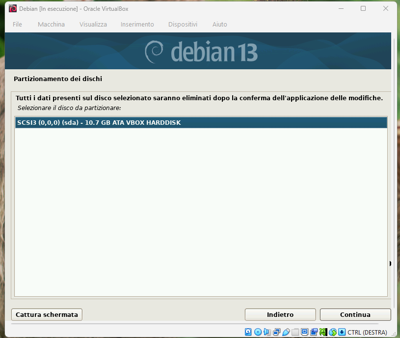

*Controllare attentamente che il disco selezionato sia quello virtuale della VM. Le modifiche riguarderanno questo disco; non scegliere un disco diverso da quello creato per il laboratorio.*

Per un sistema semplice scegliere di raccogliere tutti i file in un'unica partizione.

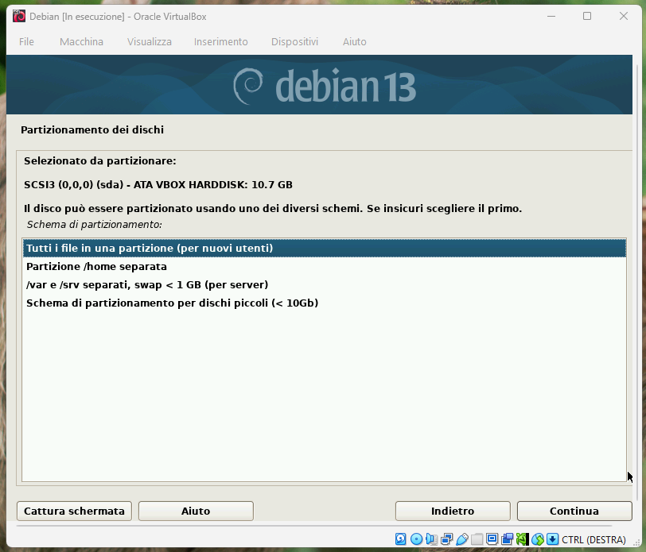

*Questa scelta mantiene insieme sistema operativo, directory personali e file di servizio. È adatta a una VM didattica; una partizione `/home` separata è utile in configurazioni più articolate.*

Esaminare il riepilogo delle partizioni proposte.

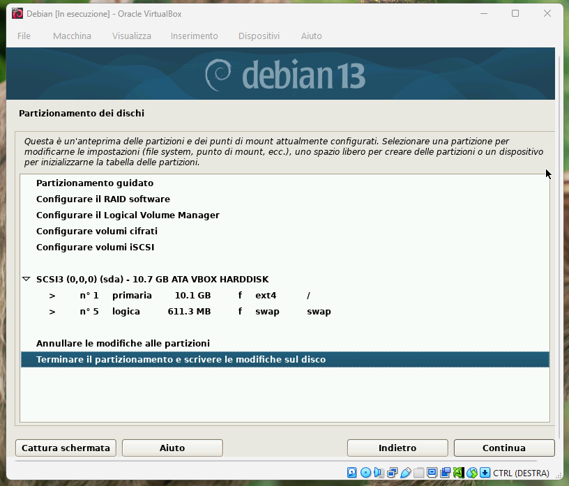

*Nell'esempio il programma crea una partizione ext4 montata come `/` e una partizione swap. La partizione `/` contiene il sistema e i file; la swap può essere usata come supporto aggiuntivo alla memoria.*

Se il riepilogo è corretto, scegliere di terminare il partizionamento e scrivere le modifiche sul disco.

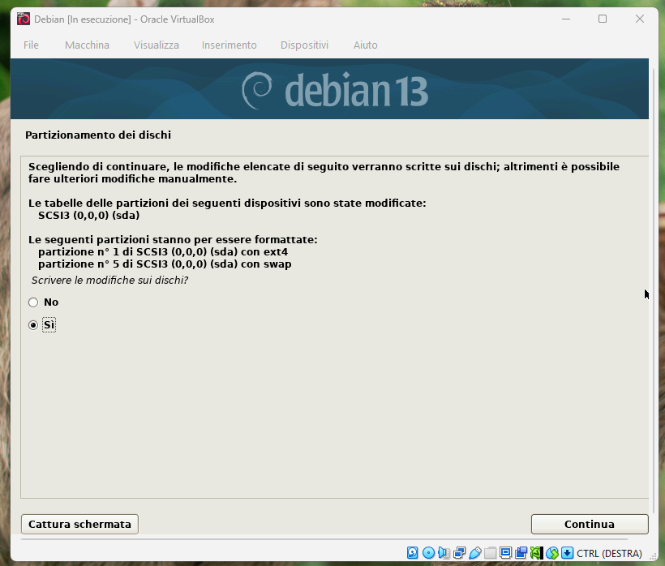

*Questa schermata riepiloga le operazioni che stanno per modificare il disco. Prima di confermare, verificare ancora che si tratti del disco virtuale della VM: i dati presenti sul disco selezionato verranno cancellati.*

## Attività 4 --- Configurare i pacchetti

Se viene chiesto di analizzare altri supporti di installazione, scegliere **No** quando si sta installando dalla sola immagine netinst e non si hanno altri supporti da aggiungere.

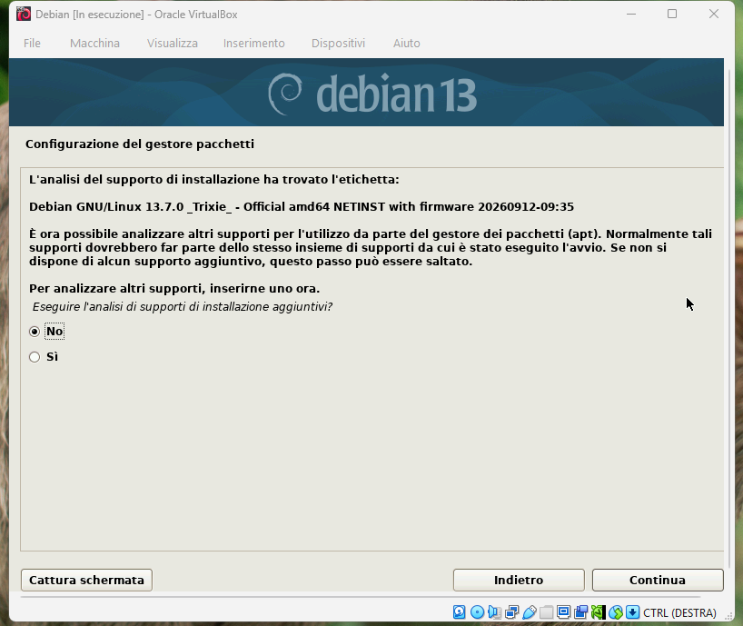

*L'installer ha già riconosciuto l'immagine netinst. La ricerca di altri supporti serve solo se si dispone di ulteriori dischi o immagini Debian da cui installare pacchetti.*

Scegliere il Paese del mirror Debian più vicino, per esempio Italia.

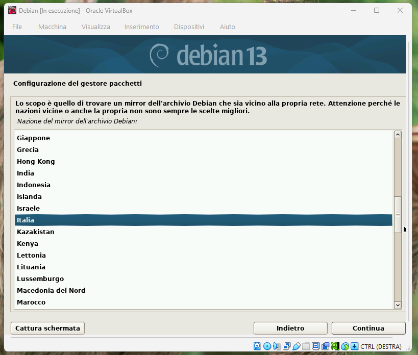

*Il mirror è un server che distribuisce i pacchetti Debian. Scegliere la propria area geografica aiuta a individuare un server adatto.*

Selezionare un mirror. Nell'esempio viene usato `deb.debian.org`.

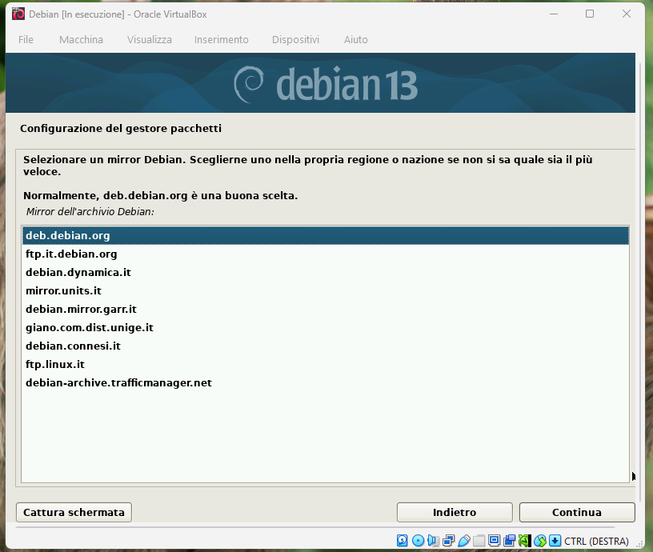

*`deb.debian.org` è un indirizzo ufficiale che indirizza verso un mirror Debian disponibile. In alternativa si può scegliere un mirror nazionale proposto dall'installer.*

Se la rete non richiede un proxy HTTP, lasciare vuoto il campo e proseguire.

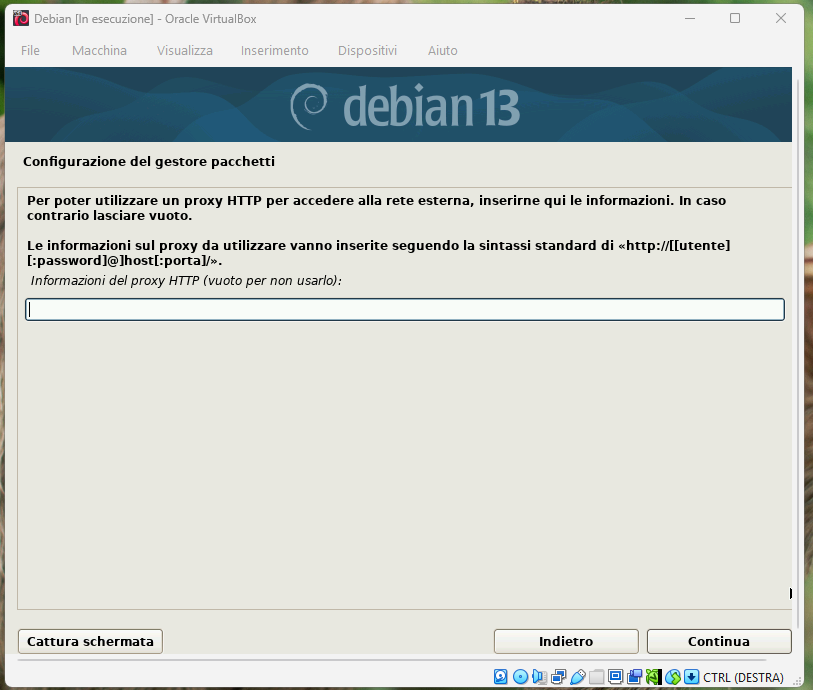

*Il proxy va compilato solo nelle reti in cui è richiesto, usando l'indirizzo e la porta forniti dall'amministratore. Nella rete domestica o nella rete NAT standard di VirtualBox di solito resta vuoto.*

Decidere se partecipare alla raccolta anonima di statistiche sull'uso dei pacchetti.

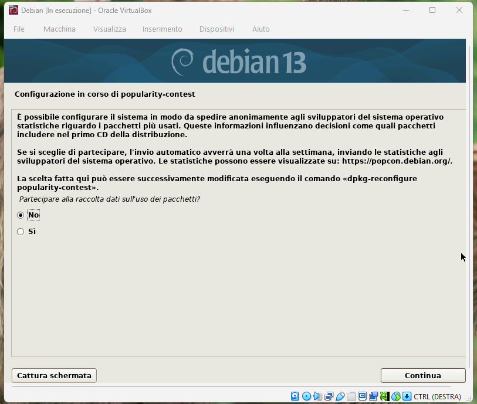

*`popularity-contest` raccoglie statistiche anonime sull'uso dei pacchetti per aiutare Debian a stabilire quali includere nei supporti. La partecipazione è facoltativa; nell'esempio è selezionato No.*

Selezionare i componenti software da installare. Per una VM da amministrare prevalentemente da terminale, lasciare deselezionati gli ambienti desktop e mantenere selezionati **server SSH** e **Utilità di sistema standard**.

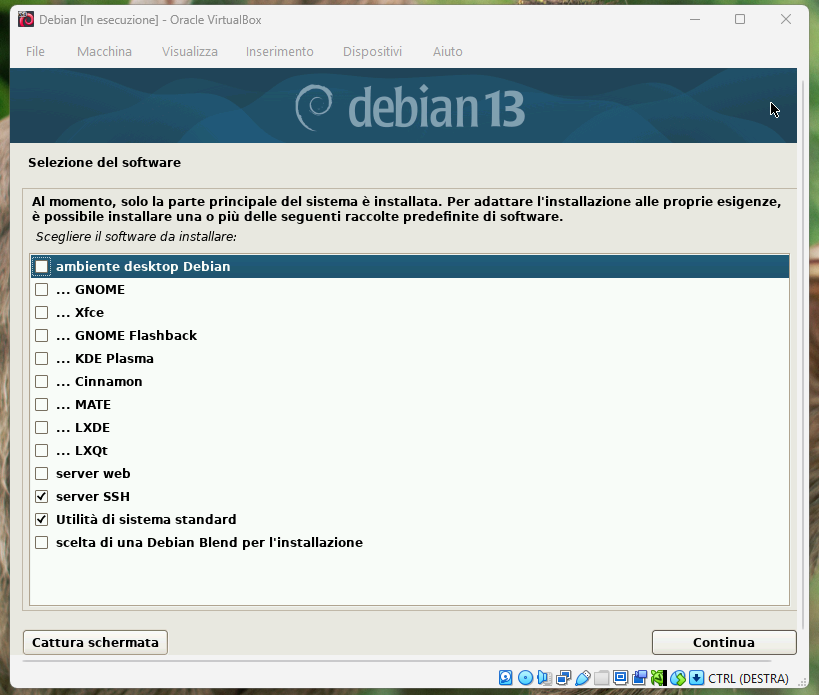

*Questa selezione installa un sistema senza interfaccia grafica, ma con gli strumenti standard e il server SSH per eventuali accessi remoti. Selezionare un ambiente desktop solo se serve usare Linux con finestre e applicazioni grafiche.*

## Attività 5 --- Installare GRUB e riavviare

Confermare l'installazione del boot loader GRUB quando l'installer chiede se installarlo.

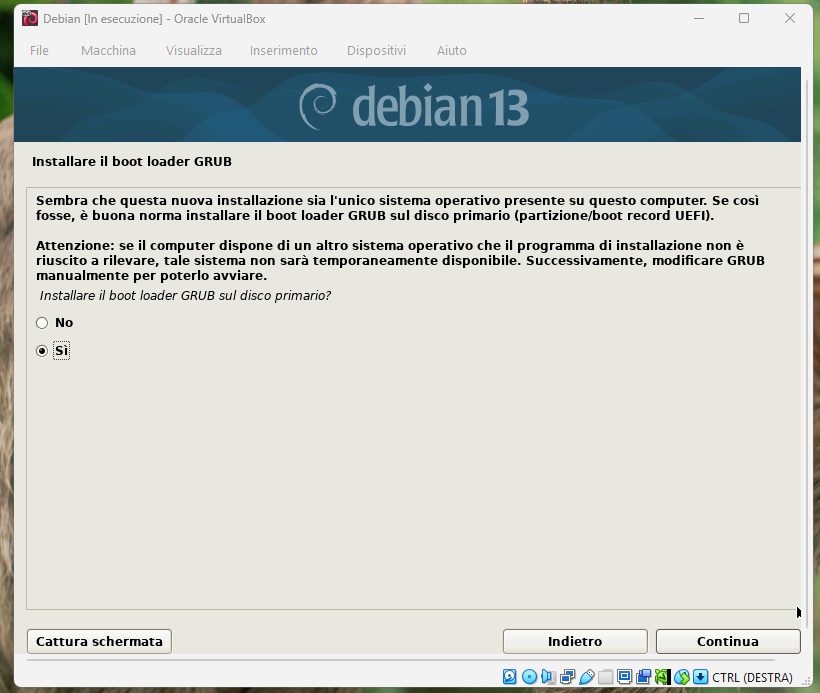

*GRUB avvia il sistema operativo installato. In una VM dedicata a Debian, scegliere Sì per installarlo sul disco virtuale.*

Selezionare come destinazione il disco principale `/dev/sda`, non una singola partizione.

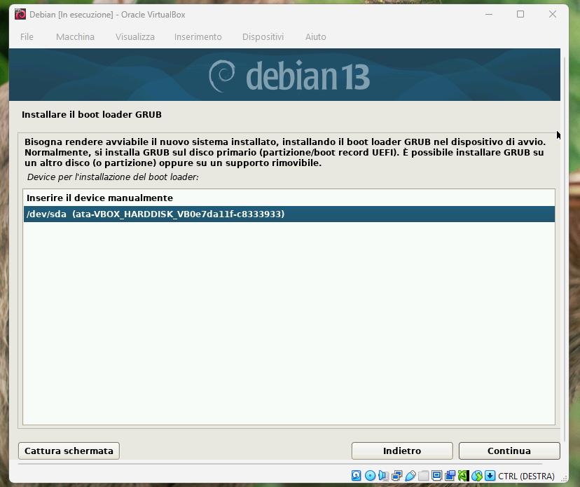

*Installando GRUB sul disco `/dev/sda`, il boot loader viene scritto nel disco virtuale e può avviare Debian quando la macchina si accende.*

Al termine, scegliere di riavviare la macchina.

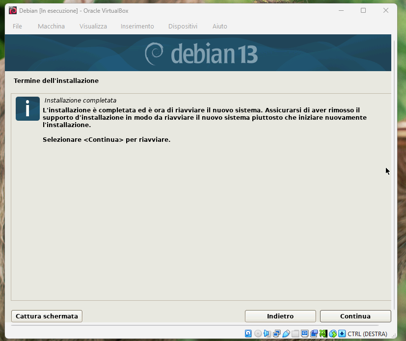

*L'installazione è completata. Prima del riavvio espellere o scollegare l'immagine ISO dal lettore ottico virtuale, se VirtualBox non la rimuove automaticamente, così la VM si avvierà dal disco appena installato.*

Al primo avvio accedere con il nome utente e la password creati durante l'installazione.

### Domande

1. Quali impostazioni vengono definite scegliendo lingua, Paese e tastiera?
2. Qual è la funzione del nome host? Quando si può lasciare vuoto il dominio?
3. Perché il disco selezionato per il partizionamento deve essere quello virtuale della VM?
4. A cosa servono la partizione `/` e la partizione swap?
5. Qual è il ruolo di un mirror Debian e quando occorre configurare un proxy?
6. Perché si può installare un sistema senza ambiente desktop? A cosa serve il server SSH?

------------------------------------------------------------------------