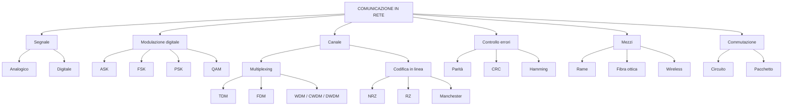

# 12. Mappa concettuale del capitolo

```mermaid
flowchart TB
    C["COMUNICAZIONE IN RETE"]
    C --> S["Segnale"]
    S --> A["Analogico"]
    S --> D["Digitale"]
    C --> M["Modulazione digitale"]
    M --> ASK["ASK"]
    M --> FSK["FSK"]
    M --> PSK["PSK"]
    M --> QAM["QAM"]
    C --> CAN["Canale"]
    CAN --> MUL["Multiplexing"]
    MUL --> TDM["TDM"]
    MUL --> FDM["FDM"]
    MUL --> WDM["WDM / CWDM / DWDM"]
    CAN --> COD["Codifica in linea"]
    COD --> NRZ["NRZ"]
    COD --> RZ["RZ"]
    COD --> MAN["Manchester"]
    C --> ERR["Controllo errori"]
    ERR --> PAR["Parità"]
    ERR --> CRC["CRC"]
    ERR --> HAM["Hamming"]
    C --> MEZ["Mezzi"]
    MEZ --> RAME["Rame"]
    MEZ --> FIB["Fibra ottica"]
    MEZ --> WIR["Wireless"]
    C --> SW["Commutazione"]
    SW --> CIR["Circuito"]
    SW --> PAC["Pacchetto"]
```

---
